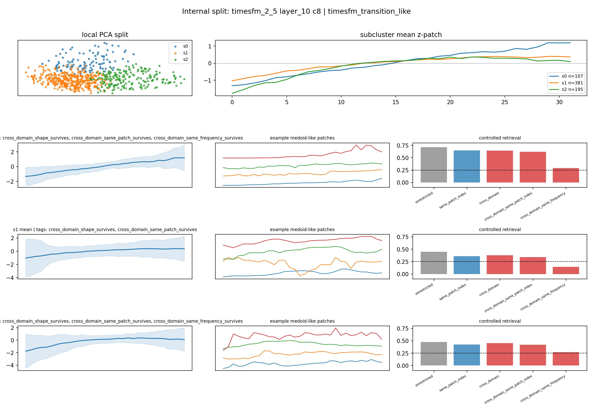
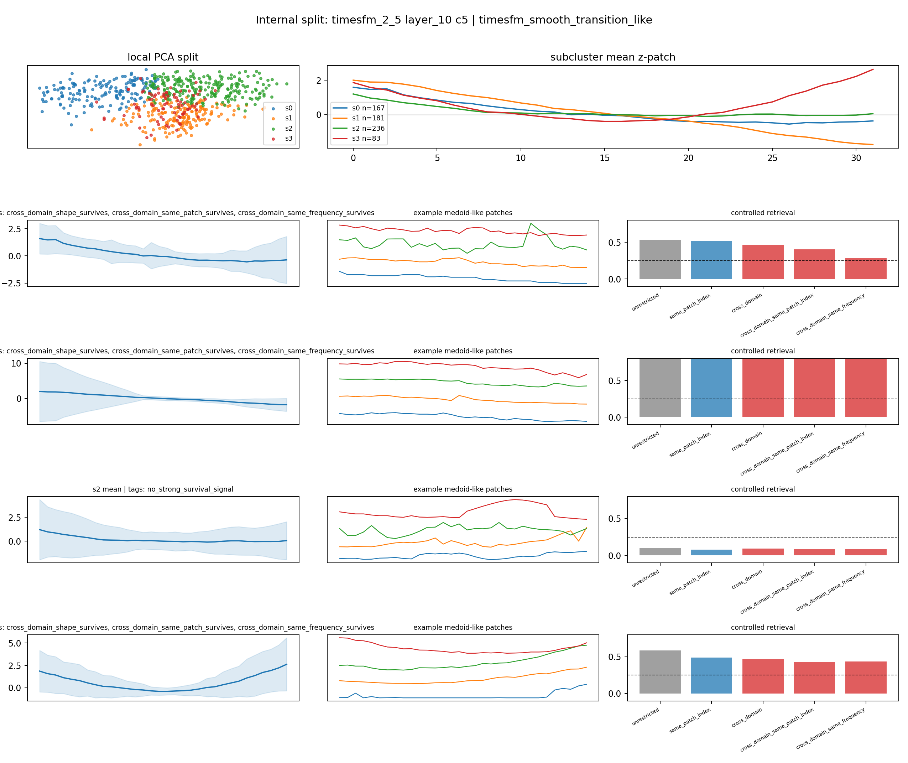
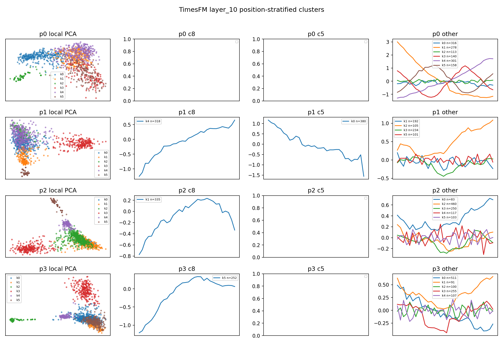
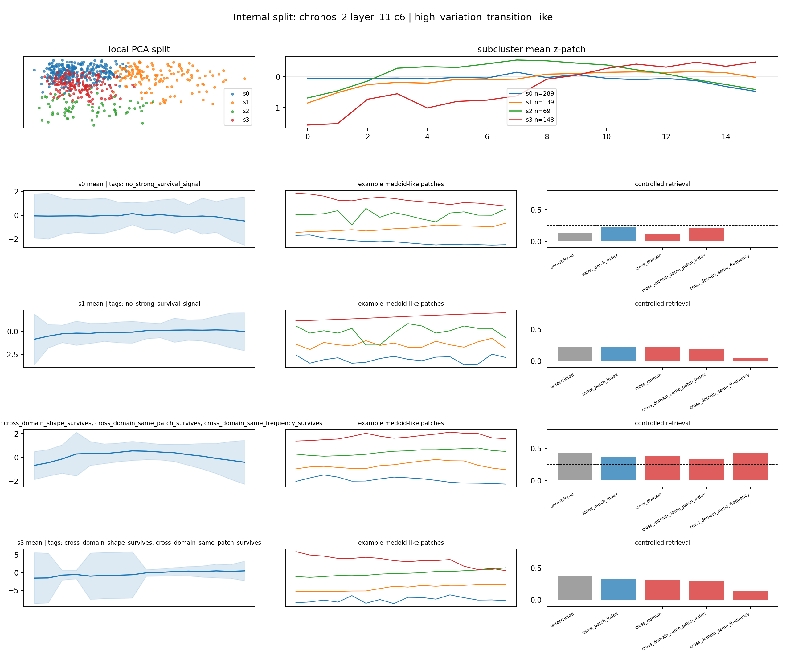

# Model-Derived Taxonomy v1 Pilot: Internal Split + Position-Stratified Audit

## 1. 本轮目标

本轮目标是继续沿着 **discover-first, name-second** 方向推进，但仍不定义最终 taxonomy。我们只做一个 taxonomy v1 pilot：把上一轮较有希望或有争议的 cluster 拆开，看是否能得到更干净、更可解释、且能通过 position/frequency-aware controlled retrieval 的 candidate concepts。

本轮重点对象：

- `TimesFM-2.5 layer_10 c8`: 上一轮最稳的 `smooth_rising_transition` candidate
- `TimesFM-2.5 layer_10 c5`: 上一轮从“不可靠”转为“heterogeneous smooth-transition pool”
- `Chronos-2 layer_11 c6`: 上一轮被降级的 Chronos heterogeneous transition pool，对照使用

运行命令：

```bash
.venv/bin/python scripts/run_taxonomy_v1_pilot.py \
  --windows-per-dataset 100 \
  --domain-balanced-patches 700 \
  --batch-size 96 \
  --queries-per-subcluster 12 \
  --top-k 10
```

输出：

- `scripts/run_taxonomy_v1_pilot.py`
- `outputs/taxonomy_v1_pilot/taxonomy_v1_pilot_summary.json`
- `outputs/taxonomy_v1_pilot/figures/`

## 2. 关键证据图

### 2.1 `TimesFM-2.5 layer_10 c8` internal split



`c8` 被拆成 3 个 subclusters，三者都保留明显的 rising / recovery shape。它们的区别主要在于上升幅度、domain/frequency 组成和跨频率稳定性：

| subcluster | size | temporary name | cross-domain | cross-domain same patch | cross-domain same frequency | 解释 |
|---|---:|---|---:|---:|---:|---|
| `c8-s0` | 107 | `strong_rising_recovery` | 0.642 | 0.619 | 0.289 | 最干净的强上升/恢复概念，三个控制条件都通过 |
| `c8-s1` | 381 | `broad_smooth_rising_transition` | 0.377 | 0.343 | 0.143 | 大而宽泛，跨 domain 和 same patch 通过，但 frequency-sensitive |
| `c8-s2` | 195 | `traffic_weighted_rising_transition` | 0.452 | 0.421 | 0.269 | 形态清楚，但有 `frequency_risk`，traffic flow 占比较高 |

判断：

`c8-s0` 是目前最适合进入 taxonomy v1 的候选概念。它不只是原始 `c8` 的重复，而是把 parent cluster 中最干净、最稳定的上升/恢复片段分离出来了。`c8-s1` 可以作为宽泛版本保留，`c8-s2` 需要继续做 frequency/domain audit。

### 2.2 `TimesFM-2.5 layer_10 c5` internal split



`c5` 的结果非常关键：它确实不是一个单一概念，而是至少包含四种不同结构。

| subcluster | size | temporary name | cross-domain | cross-domain same patch | cross-domain same frequency | 解释 |
|---|---:|---|---:|---:|---:|---|
| `c5-s0` | 167 | `smooth_falling_transition` | 0.465 | 0.404 | 0.283 | 稳定下降 transition，通过三个控制条件 |
| `c5-s1` | 181 | `strong_falling_transition` | 0.869 | 0.840 | 0.796 | 本轮最强 shape-coherent concept，几乎所有控制条件都很高 |
| `c5-s2` | 236 | `weak_mixed_transition_pool` | 0.094 | 0.085 | 0.082 | 混合/无效池，应排除或二次拆分 |
| `c5-s3` | 83 | `late_recovery_or_u_shape_transition` | 0.471 | 0.428 | 0.434 | 有回升/U-shape 倾向，但 domain/frequency risk 明显 |

判断：

`c5-s1` 是当前最强 candidate concept，比原始 `c5` 清楚很多。它可能对应模型中的 `strong_falling_transition` 或 `downward_regime_transition`。`c5-s0` 是较温和版本，也值得保留。`c5-s3` 形态上有趣，但 traffic flow 占比过高，需要更多控制；`c5-s2` 暂时不应进入 taxonomy v1。

### 2.3 TimesFM position-stratified audit



这个图回答：`c8/c5` 是否只是某个 patch position 的 artifact？

关键发现：

- `p0` 没有 `c8` 或 `c5` dominant cluster，主要由其它 parent clusters 支配；这和之前 `TimesFM c4` 的 first-patch artifact 结论一致。
- `p1` 有清楚的 `c8` dominant cluster，平均曲线是 rising transition；同时也有 `c5` dominant cluster，平均曲线是 falling transition。
- `p2` 有 `c8` dominant cluster，但 rising shape 更弱、更像 plateau/recovery middle segment。
- `p3` 有 `c8` dominant cluster，仍然表现为 rising/recovery shape。

判断：

`c8` 不是单一 patch position 造成的；它在 `p1/p2/p3` 都能以 position-stratified cluster 形式出现。但它也不是完全 position-invariant：不同 position 下 shape 有差异，`p2` 更弱，`p3` 更像 late recovery。因此 taxonomy v1 里应把它写成 `position-robust but position-modulated`。

`c5` 的 position-stratified 证据更局部：`p1` 中有明确 falling transition，`p2/p3` 更多和其它 parent cluster 混合。它更适合先作为 `p1/p3-sensitive falling transition family`，后续需要更细分。

### 2.4 `Chronos-2 layer_11 c6` internal split control



Chronos `c6` 的二次聚类支持上一轮降级判断：整个 `c6` 不是一个干净 concept，但拆分后有一个较好的 rising subcluster。

| subcluster | size | temporary name | cross-domain | cross-domain same patch | cross-domain same frequency | 解释 |
|---|---:|---|---:|---:|---:|---|
| `c6-s0` | 289 | `chronos_mixed_transition_pool` | 0.120 | 0.206 | 0.005 | 大而混合，不通过 |
| `c6-s1` | 139 | `chronos_weak_rising_pool` | 0.217 | 0.185 | 0.043 | 接近但不稳 |
| `c6-s2` | 69 | `chronos_illness_frequency_artifact` | 0.387 | 0.333 | 0.428 | 指标高，但 `illness data`/weekly frequency 风险太强 |
| `c6-s3` | 148 | `chronos_rising_transition_candidate` | 0.320 | 0.296 | 0.135 | 有一定跨域 rising signal，但 frequency-sensitive |

判断：

Chronos 不是没有 transition-like signal，而是该 signal 比 TimesFM 更分散、更容易和 frequency/domain 混合。`c6-s3` 可以作为 Chronos 侧 candidate，但暂不应作为 taxonomy v1 的主来源。`c6-s2` 是一个很好的警告：指标通过不等于概念成立，因为它明显有 domain/frequency risk。

## 3. Taxonomy v1 Pilot 候选清单

本轮建议先形成一个 **candidate concept inventory**，而不是 closed taxonomy。

### 3.1 可进入 v1 pilot 的主候选

| candidate | source | temporary definition | evidence status |
|---|---|---|---|
| `strong_rising_recovery` | `TimesFM c8-s0` | patch 内持续上升，常对应 recovery / rising transition / upward regime movement | 强，通过 cross-domain、same-patch、same-frequency 控制 |
| `strong_falling_transition` | `TimesFM c5-s1` | patch 内持续下降，下降幅度大，跨控制条件高度一致 | 最强，通过所有主要控制 |
| `smooth_falling_transition` | `TimesFM c5-s0` | 较平滑的下降 transition，幅度弱于 `c5-s1` | 强，通过主要控制 |

### 3.2 保留但需要审计的候选

| candidate | source | risk |
|---|---|---|
| `broad_smooth_rising_transition` | `TimesFM c8-s1` | parent 较大，frequency sensitivity 明显 |
| `traffic_weighted_rising_transition` | `TimesFM c8-s2` | traffic/frequency risk |
| `late_recovery_or_u_shape_transition` | `TimesFM c5-s3` | domain/frequency risk，可能是 traffic-specific recovery |
| `chronos_rising_transition_candidate` | `Chronos c6-s3` | frequency-sensitive，跨频率不稳 |

### 3.3 暂时排除

| candidate | source | reason |
|---|---|---|
| `weak_mixed_transition_pool` | `TimesFM c5-s2` | controlled retrieval 不通过 |
| `chronos_mixed_transition_pool` | `Chronos c6-s0` | 大而混合，不通过 |
| `chronos_illness_frequency_artifact` | `Chronos c6-s2` | 指标高但 domain/frequency risk 太强 |

## 4. 对研究问题的更新

现在可以更清楚地表述我们的发现：

> TSFM patch representation 中确实存在模型内生的 transition-like neighborhoods，但这些 neighborhoods 不是人类先验 taxonomy 的简单对应物。TimesFM layer_10 更倾向于把 upward recovery、downward transition 和 first-patch positional behavior 分成可见结构；Chronos layer_11 也有 transition signal，但更分散、更容易被 frequency/domain 混杂。

这比直接定义 `trend / level_shift / spike` 更有研究价值，因为它说明 “时序语言” 可能是模型自己形成的局部动态词汇：`rising recovery`、`falling transition`、`position-bound context behavior`、`frequency/domain-mediated transition` 等。

## 5. 下一步

我建议下一步做一个很小但更严谨的 **taxonomy v1 validation table**：

1. 只保留 `TimesFM c8-s0`, `TimesFM c5-s1`, `TimesFM c5-s0` 三个主候选。
2. 对每个候选导出固定 prototype bank：`20` 个 medoids + `20` 个高置信 retrieval neighbors。
3. 在 `Chronos-2-small`, `Chronos-2`, `TimesFM-2.5` 三个模型中做 cross-model retrieval：看 TimesFM 派生出的 concept 在 Chronos embedding space 是否也形成邻域。
4. 加入 negative controls：`TimesFM c4` first-patch artifact、`Chronos c7` Gaussian artifact。
5. 把 v1 taxonomy 暂时写成：
   - `strong_rising_recovery`
   - `strong_falling_transition`
   - `smooth_falling_transition`
   - `artifact_first_patch_behavior`
   - `artifact_synthetic_noise`
   - `uncertain_mixed_transition_pool`

当前结论：可以进入 taxonomy v1 pilot，但仍不能 claim final taxonomy。
