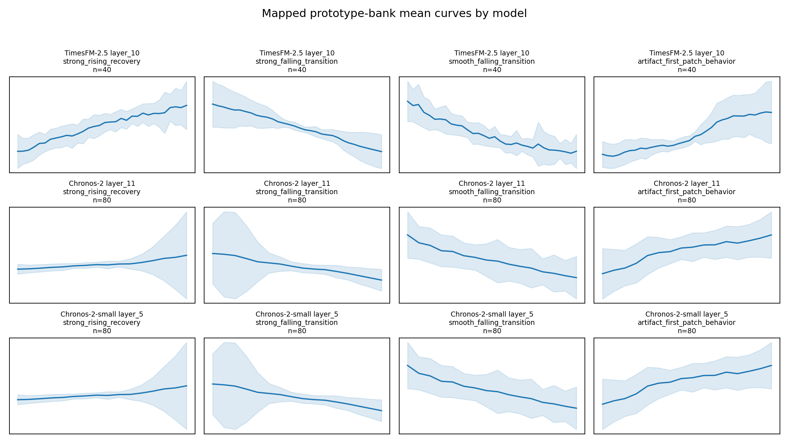
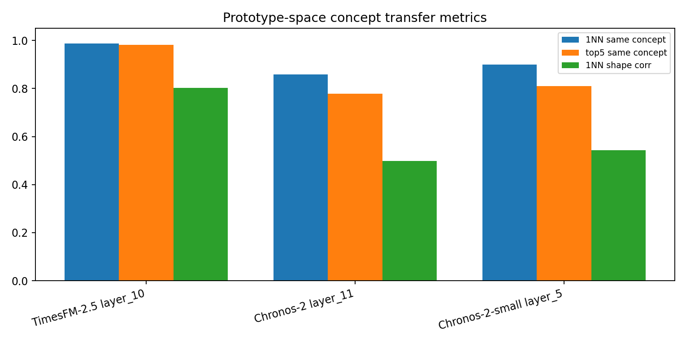
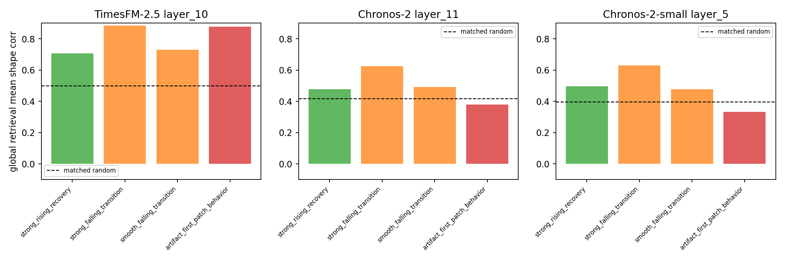

# Cross-Model Validation: TimesFM-Derived Taxonomy v1 Pilot Concepts

## 1. 本轮目标

上一轮 `taxonomy_v1_pilot` 从 `TimesFM-2.5 layer_10` 中拆出了几个候选概念：

- `strong_rising_recovery`
- `strong_falling_transition`
- `smooth_falling_transition`

本轮要回答一个更关键的问题：

> 这些从 TimesFM representation 中发现的 concepts，在 `Chronos-2` 和 `Chronos-2-small` 的 patch representation 中是否也有对应的邻域结构？

这一步不是最终 taxonomy claim，而是 cross-model sanity check。若 TimesFM 派生概念只在 TimesFM 自己的 embedding space 中成立，那么它更像 model-specific artifact；若映射到 Chronos 后仍有结构，则更接近跨模型 temporal concept candidate。

运行命令：

```bash
.venv/bin/python scripts/run_cross_model_concept_validation.py \
  --windows-per-dataset 100 \
  --domain-balanced-patches 700 \
  --batch-size 96 \
  --top-k 10 \
  --medoids-per-concept 20 \
  --neighbors-per-concept 20
```

输出：

- `scripts/run_cross_model_concept_validation.py`
- `configs/model_derived_taxonomy_v1_validation.yaml`
- `outputs/cross_model_validation/prototype_bank.json`
- `outputs/cross_model_validation/cross_model_validation_summary.json`
- `outputs/cross_model_validation/figures/`

## 2. Prototype Bank 与映射规则

Prototype bank 来源于 `TimesFM-2.5 layer_10` 的 domain-balanced internal splits。每个概念取：

- `20` 个 medoid-like prototypes
- `20` 个 high-confidence retrieval neighbors

总计 `160` 个 TimesFM prototypes：

| concept | count | role |
|---|---:|---|
| `strong_rising_recovery` | 40 | candidate |
| `strong_falling_transition` | 40 | candidate |
| `smooth_falling_transition` | 40 | candidate |
| `artifact_first_patch_behavior` | 40 | negative control |

跨模型映射：

- TimesFM patch length = `32`，直接使用同一 `window_id + patch_index`。
- Chronos patch length = `16`，因此 TimesFM patch `p` 映射到 Chronos patch `2p` 和 `2p+1`。
- evaluation 在目标模型的 `full_equal_per_dataset` patch space 中做，避免 domain-balanced sampling 把 prototypes 过滤掉。

## 3. 关键证据图

### 3.1 Prototype 曲线是否保留形态？



这张图显示：TimesFM 派生的 32-step concepts 映射到 Chronos 的 16-step patches 后，平均形态仍基本保留方向：

- `strong_rising_recovery` 在 Chronos 中变成较短的上升/回升片段，形态比 TimesFM 更碎，但方向仍可见。
- `strong_falling_transition` 在三个模型中都保持清楚下降趋势。
- `smooth_falling_transition` 在 Chronos 中仍是下降，但波动更大。
- `artifact_first_patch_behavior` 也保持较强结构，说明 position/context artifact 也会跨模型映射，不能只看形态相似。

### 3.2 Prototype-space concept agreement



这里把 prototype bank 映射到每个模型的 embedding space，只在 prototype bank 内做 nearest-neighbor agreement：

| model/layer | mapped patches | silhouette | 1NN same concept | top5 same concept | 1NN shape corr |
|---|---:|---:|---:|---:|---:|
| `TimesFM-2.5 layer_10` | 160 | 0.309 | 0.988 | 0.981 | 0.802 |
| `Chronos-2 layer_11` | 320 | 0.078 | 0.859 | 0.778 | 0.499 |
| `Chronos-2-small layer_5` | 320 | 0.079 | 0.900 | 0.810 | 0.544 |

解读：

- TimesFM 自空间最强是预期结果，因为 prototype bank 就从 TimesFM 中派生。
- 关键是 Chronos 的结果：`Chronos-2` 和 `Chronos-2-small` 中 1NN same concept 都明显高于随机水平，说明这些 concepts 在 Chronos embedding 中不是完全散掉。
- 但 Chronos 的 silhouette 只有约 `0.078`，远低于 TimesFM 的 `0.309`，说明 Chronos 中 concepts 更弱、更交叠。

### 3.3 Global retrieval shape coherence



这张图看的是：把 prototype query 放回全体 patch embedding space 中检索，top-k neighbor 在原始 shape 上是否相似。虚线是 matched random baseline。

| concept | TimesFM shape corr | Chronos-2 shape corr | Chronos-2-small shape corr |
|---|---:|---:|---:|
| `strong_rising_recovery` | 0.707 | 0.477 | 0.496 |
| `strong_falling_transition` | 0.884 | 0.626 | 0.630 |
| `smooth_falling_transition` | 0.730 | 0.491 | 0.477 |
| `artifact_first_patch_behavior` | 0.877 | 0.380 | 0.332 |
| matched random baseline | 0.498 | 0.418 | 0.395 |

解读：

- `strong_falling_transition` 是最强跨模型候选：在 TimesFM、Chronos-2、Chronos-2-small 中都明显高于对应 random baseline。
- `strong_rising_recovery` 在 Chronos 中略高于 baseline，但优势不大；它可能是较弱或更 position/context-modulated 的概念。
- `smooth_falling_transition` 在 Chronos 中高于 baseline，但 prototype bank 有 traffic-flow 偏重，后续需要 domain-balanced prototype refinement。
- `artifact_first_patch_behavior` 在 TimesFM 中非常强，但在 Chronos 中 global retrieval shape coherence 低于或接近 baseline；这支持它是 TimesFM 更强的 first-patch artifact，而不是要纳入 temporal concept 的对象。

## 4. Concept-Level 判断

### 4.1 `strong_falling_transition`: 最强跨模型候选

Evidence:

- `TimesFM-2.5 layer_10`: 1NN same concept `0.975`, global shape corr `0.884`
- `Chronos-2 layer_11`: 1NN same concept `0.750`, global shape corr `0.626`
- `Chronos-2-small layer_5`: 1NN same concept `0.875`, global shape corr `0.630`

判断：

这是目前最 defensible 的 taxonomy v1 concept。它不仅在 TimesFM 内部很干净，映射到两个 Chronos 模型后仍保持较强 shape coherence 和 prototype-space agreement。

临时定义：

> `strong_falling_transition`: patch 内持续下降、下降幅度较大、跨模型可复现的局部 transition concept。

主要 caveat：

- prototype bank 中 Weather 占比高，需要下一步做 domain-balanced prototype bank。

### 4.2 `smooth_falling_transition`: 成立，但可能与强下降合并

Evidence:

- `TimesFM-2.5 layer_10`: 1NN same concept `0.975`, global shape corr `0.730`
- `Chronos-2 layer_11`: 1NN same concept `0.950`, global shape corr `0.491`
- `Chronos-2-small layer_5`: 1NN same concept `0.988`, global shape corr `0.477`

判断：

这个概念在 prototype-space 中很稳定，但 global retrieval shape coherence 在 Chronos 中只是中等。它可能是 `strong_falling_transition` 的弱幅度版本，也可能是 traffic-flow dominated 的 domain-specific falling pattern。

建议：

- 暂时保留为 secondary concept。
- 后续比较它与 `strong_falling_transition` 的 centroid distance 和 prototype confusion；如果边界不清，可以合并成 `falling_transition` family。

### 4.3 `strong_rising_recovery`: 有跨模型信号，但弱于下降类

Evidence:

- `TimesFM-2.5 layer_10`: 1NN same concept `1.000`, global shape corr `0.707`
- `Chronos-2 layer_11`: 1NN same concept `0.950`, global shape corr `0.477`
- `Chronos-2-small layer_5`: 1NN same concept `0.913`, global shape corr `0.496`

判断：

这个概念在 prototype-space 中迁移得不错，但在 global retrieval 中只略高于 random baseline。一个原因是 TimesFM 的 32-step rising recovery 映射到 Chronos 后被拆成两个 16-step half-patches，完整 recovery shape 被截断。

建议：

- 保留为 candidate，但下一步要用 Chronos-native 16-step rising prototypes 做对照。
- 不要单独 claim 它已经是 robust cross-model concept。

### 4.4 `artifact_first_patch_behavior`: 继续作为 negative control

Evidence:

- `TimesFM-2.5 layer_10`: 1NN same concept `1.000`, global shape corr `0.877`
- `Chronos-2 layer_11`: 1NN same concept `0.788`, global shape corr `0.380`
- `Chronos-2-small layer_5`: 1NN same concept `0.825`, global shape corr `0.332`

判断：

这个结果很重要：artifact 也可以在 prototype-space 中形成高 agreement。因此 taxonomy v1 的纳入标准不能只看 1NN agreement；必须结合 patch-index audit、position-stratified analysis 和 negative controls。

`artifact_first_patch_behavior` 不进入 taxonomy v1，只保留为 artifact control。

## 5. 当前 Taxonomy v1 Pilot 建议

建议把 taxonomy v1 pilot 暂时写成：

| label | status | rationale |
|---|---|---|
| `strong_falling_transition` | primary | 最强跨模型证据 |
| `falling_transition` / `smooth_falling_transition` | secondary or merge candidate | 跨模型存在，但可能与强下降合并 |
| `strong_rising_recovery` | candidate | 有信号，但 Chronos global retrieval 较弱 |
| `artifact_first_patch_behavior` | negative control | position/context artifact |
| `artifact_synthetic_noise` | negative control | synthetic-domain artifact |
| `uncertain_mixed_transition_pool` | exclusion | 当前不作为 concept |

## 6. 下一步

下一步不建议继续加模型，而是修正 prototype bank 的偏差：

1. 构建 domain-balanced prototype bank：每个 concept 每个 domain 最多取固定数量，避免 `traffic flow` 或 `weather` 主导。
2. 做 family-level merge test：比较 `strong_falling_transition` 和 `smooth_falling_transition` 是否应该合并为 `falling_transition`。
3. 做 Chronos-native prototype discovery：在 Chronos 的 rising/falling subclusters 中独立抽 prototypes，看是否能和 TimesFM-derived concepts 对齐。
4. 加入 direction-flip control：检查上升/下降是否只是 sign inversion 或 normalization artifact。

当前最稳妥的论文表述是：

> TimesFM-derived falling-transition concepts can be partially transferred to Chronos representations, suggesting that at least some TSFM patch-token neighborhoods correspond to cross-model local temporal dynamics. However, artifact controls show that position/context effects can also produce coherent neighborhoods, so concept claims require explicit confounder audits.
