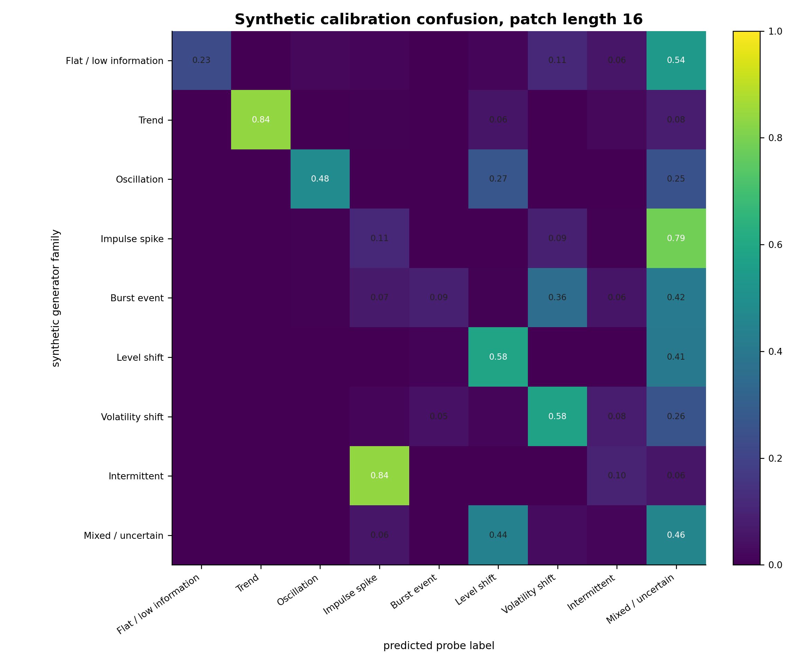
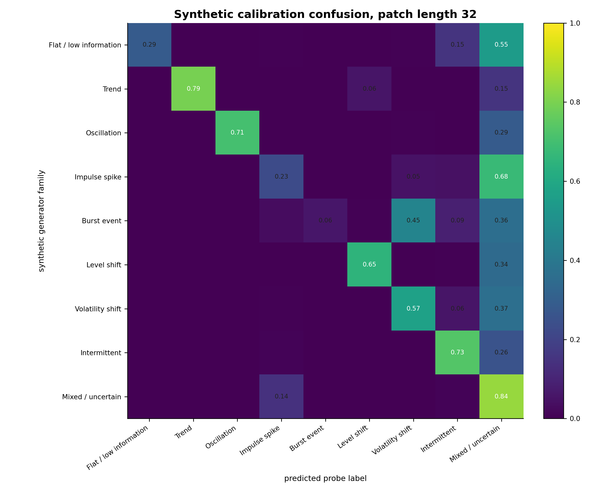
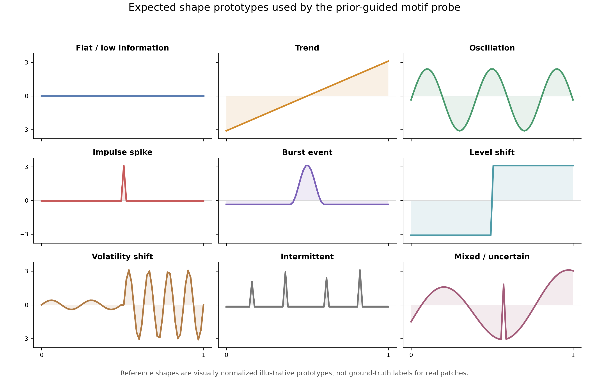
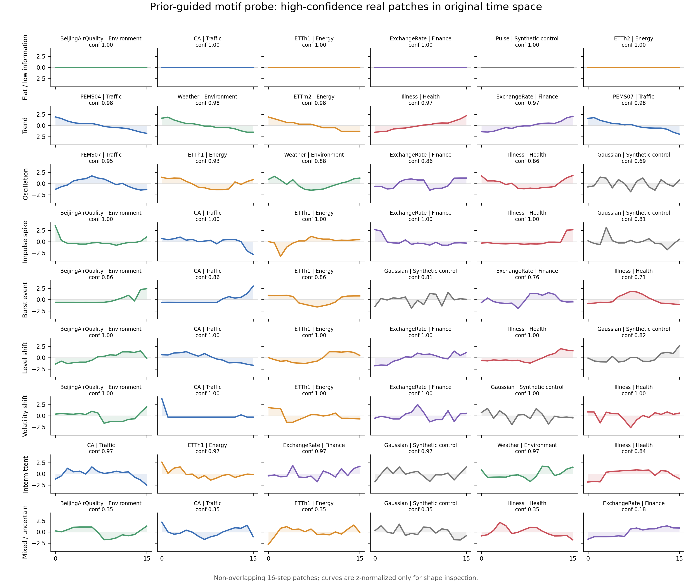
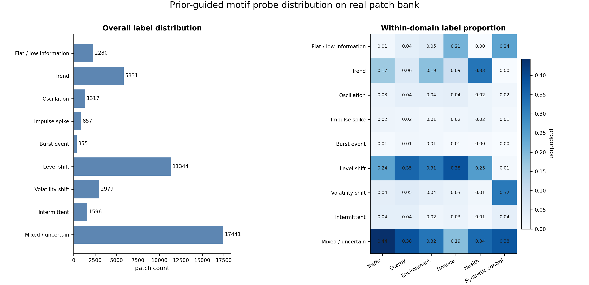
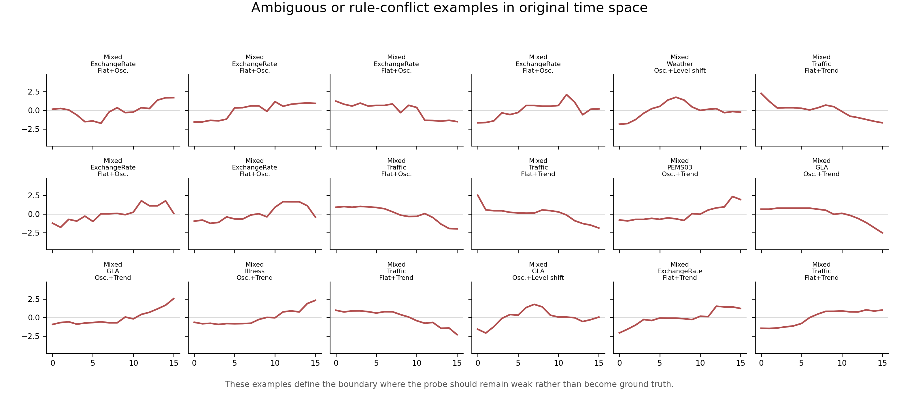

# Prior-Guided Motif Probe 原空间 Sanity Check

## 1. 目的

这个检查补上一个关键证据：`motif taxonomy v0` / `prior-guided motif probe` 不是 ground truth，但在用它审计 TSFM representation clusters 之前，我们必须先确认这套 deterministic classifier 在 original time-series space 中确实能选出符合人类直觉的 `shapelet-like local patterns`。

因此本报告只回答一个窄问题：这些规则能否按预期把 patch 分成 trend、oscillation、spike、burst、level shift、volatility shift、intermittent、flat 和 mixed/uncertain？它不用于给 KMeans cluster 命名，也不证明真实世界存在唯一正确的 motif taxonomy。

## 2. 实验设置

- real dataset root: `/data/junjieqiu/datasets/basicts_datasets`
- excluded dataset: `BLAST`
- patch length: `16`
- context length: `128`
- windows per dataset: `250`
- sampled real patches: `44000`
- high-confidence threshold for real examples: `0.65`

Classifier 来自 `scripts/explore_motif_taxonomy.py::label_patch`，核心是 robust z-normalization 后的 deterministic shape statistics：linear fit、FFT/spectral concentration、robust outlier count、active-run statistics、mean change score、variance ratio，以及 raw std/range。

| probe label | 主要数学/统计判定 | 稳健性判断 |
|---|---|---|
| `flat_low_information` | raw std 与 raw range 很低 | control label，真实数据中受预处理和量纲影响 |
| `trend` | robust z 后 linear fit 的 `abs_slope` 和 `R2` 高 | 16-step patch 下相对稳健 |
| `oscillation` | FFT dominant component power ratio 高，且 zero-crossing 足够 | 16-step 下边界敏感，32-step 更稳 |
| `impulse_spike` | 1-2 个 isolated extreme robust z-score points | soft probe，容易受 outlier 和边界影响 |
| `burst_event` | contiguous active run，宽于单点 spike 但短于整段 patch | soft probe，容易和 spike/intermittent 混淆 |
| `level_shift` | best two-segment mean difference / pooled variance 高 | 可用，但 smooth ramp 会与 trend 混淆 |
| `volatility_shift` | split 前后 std ratio 高，mean change 不强 | 谨慎使用，需要更多 change-point audit |
| `intermittent` | 多个 separated active runs，且没有单个 dominant impulse | 16-step 下常退化成 spike，32-step 更稳 |
| `mixed_uncertain` | detector 弱、冲突或 top-score margin 太小 | 必须保留，避免 false hard label |

## 3. Synthetic Calibration

Synthetic calibration 用带已知生成机制的 patches 检查规则是否大体按设计工作。它不是现实语义 ground truth，但可以暴露规则之间的混淆边界。

- patch length 16: accuracy including mixed = `0.386`, non-uncertain coverage = `0.638`
- patch length 32: accuracy including mixed = `0.542`, non-uncertain coverage = `0.573`

读图方式：行是 synthetic generator family，列是 probe 预测标签。对角线越强，说明规则越接近预设语义；非对角线暴露了规则混淆。例如短 patch 下 `burst_event`、`intermittent` 和 `impulse_spike` 容易相互混淆，这也是后续报告中一直把 event-like labels 作为 soft audit probe 的原因。

### 3.1 关键负结果：当前 classifier 不能可靠得到我们想要的 motif 分类

这个 sanity check 的最重要结论不是“规则大体可用”，而是相反：**当前 deterministic classifier 无法稳定、准确地恢复我们希望表达的 human-prior motif classes**。因此它不应被继续写成一个可靠的 `motif classifier`，最多只能作为一个失败边界明确的 weak audit probe / negative control。

量化证据如下：

- patch length 16 的 overall accuracy including mixed 只有 `0.386`；也就是说，在 Chronos-2 的 16-step patch setting 下，规则分类和我们预设生成机制的一致性很弱。
- patch length 32 虽然更好，但 accuracy including mixed 也只有 `0.542`，仍不足以支持把它当作 reliable ground-truth-like labels。
- 在 16-step 下，`impulse_spike` recall 只有 `0.111`，`burst_event` recall 只有 `0.089`，`intermittent` recall 只有 `0.100`。
- `intermittent` 在 16-step synthetic patches 中大量被判成 `impulse_spike`，而 `burst_event` 又经常被判成 `volatility_shift` 或 `mixed_uncertain`。这说明 active-run / outlier / variance-ratio 规则在短 patch 上没有形成我们直觉中清楚的语义边界。
- 真实数据上 `mixed_uncertain` rate 达到 `0.396`，并且 `level_shift` 与 `mixed_uncertain` 占比很高，说明当前规则很容易把复杂局部形态压到少数统计触发项上。

因此，后续所有 TSFM cluster 分析中，`prior-guided motif` 必须降级为 **human-prior diagnostic annotation**：它只能帮助我们发现“model-derived cluster 与人类先验是否一一对应”这个问题，不能作为 cluster 命名依据，不能作为 taxonomy v1 的监督信号，也不能被当作模型学到了某个 motif 的证明。

## 4. Real Patch Original-Space Inspection

先放一张 reference figure：这是我们之前 PPT 里展示过的 human-prior expected shapes，也就是 classifier 期望捕捉的形态原型。它们只用于帮助读者理解规则目标，不代表真实数据中的 ground truth motif。

下面这张图直接回到真实数据 patch 的原空间。每一行是一个 probe label，每个小图是 classifier 选出的 high-confidence 或代表性 patch。曲线只做 z-normalization 以便比较形状；它们仍是原始时间轴上的 patch，不是 embedding-space 投影。

这张图的作用是回答老师最可能追问的问题：`prior-guided motif` 到底长什么样？但对照 expected shapes 后可以看到，真实数据中的高置信样本并不总是落在人类直觉中的干净 prototype 上。`trend`、部分 `oscillation` 和部分 `level_shift` 还算可解释；但 `impulse_spike`、`burst_event`、`volatility_shift`、`intermittent` 经常混入 step-like、ramp-like、scale-driven 或 boundary-cut 形态。因此这张图支持的结论是：当前 probe 可以暴露规则失败边界，但不能证明它已经正确 classify patches。

## 5. Label Distribution on Real Patch Bank

真实数据上的 `mixed_uncertain` rate 为 `0.396`。这不是失败，而是我们主动保留 classifier 边界的安全阀：当规则冲突或信号不够强时，不强行把 patch 贴成先验 motif。

这张图说明 prior-guided motif probe 在真实 patch bank 上并不是均匀分布的，也会受到 macro-domain 和 dataset composition 影响。更重要的是，label distribution 反映的是 detector 触发频率，不等于真实 motif 语义分布。因此在 TSFM cluster audit 中，它只能作为解释性 diagnostic，不能作为训练标签、cluster ground truth 或 taxonomy v1 的候选来源。

## 6. Ambiguity and Failure Boundary

这些例子是报告里应该主动展示的 failure boundary：一些 patch 同时触发多个 detector，或者形态处在 spike/burst/intermittent、trend/level-shift、flat/noise 的边界。后续如果 cluster 的 prior-guided motif 分布不纯，不能立刻说 cluster 失败；更合理的解释是 TSFM 的 model-derived motif clusters 可能不是 human-prior taxonomy 的一一映射。

## 7. 可以稳健声称什么

- 当前 `prior-guided motif probe` 没有通过 reliable classifier 的 sanity check；它不能稳定恢复我们预期的 human-prior motif classes。
- `trend`、部分 `oscillation` 和部分 `level_shift` 可以作为弱解释线索；但即便这些类别也不能被视为 ground truth。
- `impulse_spike`、`burst_event`、`volatility_shift`、`intermittent` 在短 patch 上混淆严重，应主要作为 failure-boundary evidence，而不是正向语义标签。
- `mixed_uncertain` 是必要标签，用来避免把 composite / boundary-cut patches 误当作干净 motif。
- 这个 sanity check 支持我们在 TSFM cluster 报告中使用 `prior-guided motif probe NMI` 和 label distribution 作为 audit evidence，但解释方向应是：model-derived clusters 不应被迫对齐一个本身不可靠的 human-prior classifier。

## 8. 下一步接入 TSFM Cluster 报告

建议在 `Chronos-2` layer-wise validation 报告中引用本报告作为前置负结果：先说明 human-prior probe 没有成为可靠 classifier，再展示 model-derived clusters 与该 probe 并非一一对应。这样 narrative 会更严谨：我们不是先验定义 taxonomy 后强行套模型，而是证明先验 classifier 本身不足以定义 patch-level temporal concepts，因此需要转向 model-derived motif taxonomy discovery protocol。

## 9. 输出文件

- summary: `outputs/prior_guided_probe_sanity/prior_guided_probe_sanity_summary.json`
- expected prototypes: `outputs/prior_guided_probe_sanity/figures/expected_prior_guided_prototype_shapes.png`
- real examples: `outputs/prior_guided_probe_sanity/figures/real_patch_high_confidence_examples.png`
- real distribution: `outputs/prior_guided_probe_sanity/figures/real_patch_label_distribution.png`
- ambiguity examples: `outputs/prior_guided_probe_sanity/figures/real_patch_ambiguity_examples.png`
- synthetic patch16 confusion: `outputs/prior_guided_probe_sanity/figures/synthetic_calibration_confusion_patch16.png`
- synthetic patch32 confusion: `outputs/prior_guided_probe_sanity/figures/synthetic_calibration_confusion_patch32.png`
