# Advisor Meeting PPT 素材包：TSFM Patch-Token Motif Discovery

> 用途：给 Yuxuan Liang 老师汇报前的手工排版素材。  
> 原则：这里不生成完整 PPT，只提供 **原始图片、屏幕文案、排版提示、口头讲法和防守问答**。  
> 图内文字统一使用英文；PPT 正文可以中文叙述并保留 English technical terms。

## 0. 统一排版规则

建议整体使用 16:9 白底，尽量像论文 figure，而不是 poster。

- 页面标题：中文或中英混合，32-40 pt。
- 页面副标题：18-22 pt，灰色。
- 正文 bullet：22-26 pt，每页 3 条以内。
- 图内文字：只用英文；不要在图内放中文注释，也不要出现下划线；所有 label 都写成 publication-style phrase，例如 `strong falling transition`，不要写 code-style labels。
- 图外 caption：可以中文，14-16 pt，放在图下方。
- 每页最多一个核心证据图；不要把多个小图挤在同一页，除非它本来就是 panel figure。
- 图建议插入为原始 PNG，不要截图；保持纵横比。
- 对老师解释时，把 `motif taxonomy v0` 口头换成 **human-prior / prior-guided motif probe**，把 `model-derived motif taxonomy v1` 换成 **model-derived candidate motif families**。`v0/v1` 可以作为仓库内部文件名，不建议放在主 PPT 屏幕文字里。

## 1. 推荐图片素材清单

主 PPT 优先使用下面这些 **raw figure assets**。它们只包含图本身，不包含整页 slide 标题、长解释或 presenter message，适合你在 PowerPoint 里手工排版。

| 用途 | 推荐图片 | 尺寸 |
|---|---|---:|
| hypothesis 与证据对应关系 | `../outputs/ppt_raw_assets/fig_hypothesis_evidence_map.png` | 2986×1040 |
| 证据缺口审计 | `../outputs/ppt_raw_assets/fig_evidence_gap_audit.png` | 3097×1082 |
| discover-first 方法流程 | `../outputs/ppt_raw_assets/fig_discover_first_protocol_flow.png` | 3041×707 |
| prior-guided motif probe 文献来源 | `../outputs/ppt_raw_assets/fig_prior_probe_literature_map.png` | 3624×1359 |
| prior-guided motif probe 形状与局限 | `../outputs/ppt_raw_assets/fig_prior_probe_shapes_and_limits.png` | 4058×2324 |
| prior-guided motif probe 原型形状与判断标准 | `../outputs/ppt_raw_assets/fig_prior_probe_prototype_shapes.png` | 2777×2135 |
| prior-guided motif probe 非 ground truth 证据 | `../outputs/ppt_raw_assets/fig_prior_probe_alignment_evidence.png` | 2458×978 |
| prior-guided motif probe 在真实 patch bank 上的分布 | `../outputs/ppt_raw_assets/fig_prior_probe_distribution_real_patch_bank.png` | 2712×1041 |
| TimesFM hidden-space 聚类三视图 | `../outputs/ppt_raw_assets/fig_timesfm_clustering_triptych_labeled.png` | 3080×916 |
| domain-balanced falling transition 原空间证据 | `../outputs/ppt_raw_assets/fig_domain_balanced_falling_family.png` | 4055×1975 |
| TimesFM / Chronos-2 / Chronos-2-small native candidate patches | `../outputs/ppt_raw_assets/fig_model_native_candidate_patches_redrawn.png` | 3294×1532 |
| 其它聚类结果 gallery | `../outputs/ppt_raw_assets/fig_cluster_outcome_gallery_v2.png` | 3457×2664 |
| raw / tokenizer-projection / hidden lineage 指标 | `../outputs/ppt_raw_assets/fig_lineage_metric_story.png` | 3850×1265 |
| controlled retrieval heatmap | `../outputs/ppt_raw_assets/fig_controlled_retrieval_heatmap_readable.png` | 3428×1349 |
| negative control artifact | `../outputs/ppt_raw_assets/fig_negative_control_artifact.png` | 3400×1163 |
| cross-model validation | `../outputs/ppt_raw_assets/fig_cross_model_validation_story.png` | 3624×1385 |

配套 JSON：

- `../outputs/ppt_raw_assets/prior_probe_shapes_and_limits_summary.json`
- `../outputs/ppt_raw_assets/prior_probe_distribution_summary.json`
- `../outputs/ppt_raw_assets/domain_balanced_falling_family_summary.json`
- `../outputs/ppt_raw_assets/model_native_candidate_patches_summary.json`
- `../outputs/ppt_raw_assets/raw_asset_manifest.json`

旧的 `outputs/ppt_assets/` 是整页式 preview，不建议直接放入明天汇报的主 PPT。若需要 backup，可只截取其中图表区域。

## 1.5. 当前证据缺口审计

**推荐图片**

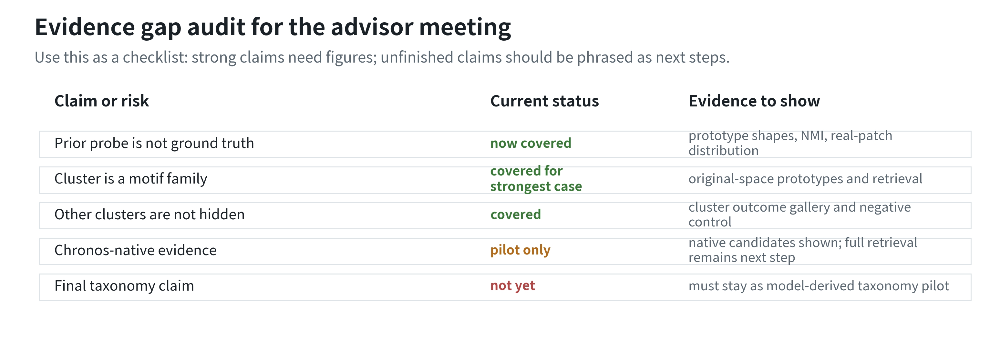

**结论**

现在主 PPT 中必须主动承认两点：第一，Chronos-native evidence 仍是 pilot，还没有完整 controlled retrieval；第二，不能 claim final taxonomy。其余老师最可能追问的点，包括 prior probe 为什么不是 ground truth、其它 cluster 长什么样、strongest candidate 是否有原空间证据，都已经有对应图片。

## 2. 建议页序与文案

### Slide 1. Opening Question

**屏幕文案**

What is the temporal language of TSFMs?

From prior-guided motif probes to model-derived candidate motif families

Models: `Chronos-2-small`, `Chronos-2`, `TimesFM-2.5`

**排版提示**

左侧放大标题，右侧手工画一个极简流程：`raw series -> patch tokens -> hidden states -> candidate motif families`。这一页不要放复杂实验图。

**口头讲法**

我这次不是汇报 forecasting performance，而是问 patch-based TSFMs 的 patch token representation 到底学到了什么。我们先用 human-prior motif probe 做解释锚点，再从 representation space 反向发现 model-derived candidate motif families。

### Slide 2. Research Hypotheses

**推荐图片**

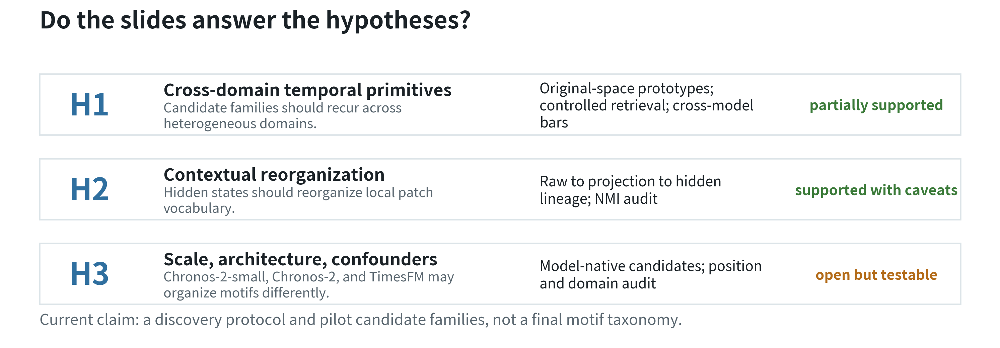

**屏幕文案**

H1: Cross-domain temporal primitives  
H2: Contextual reorganization  
H3: Scale, architecture, and confounders

**排版提示**

建议直接用 `fig_hypothesis_evidence_map.png`，占页面宽度 78-86%。右侧或图下只放一句：`Current claim: a discovery protocol and pilot candidate families, not a final motif taxonomy.` 这样后面 Slide 11/12 回到 H2/H3 时不会突兀。

**口头讲法**

先把 H1/H2/H3 讲清楚，后面再说“这页回答 H2”就不会突兀。H1 看模型是否学到跨域共用的 motif/prototype family；H2 看 hidden layer 是否把 local patch vocabulary 重组为 contextualized family；H3 看这些结构是否受 scale、architecture 和 confounders 影响。

### Slide 3. Prior-Guided Motif Probe

**推荐图片**

主讲优先用这三张拆分 raw asset，方便手工排版：

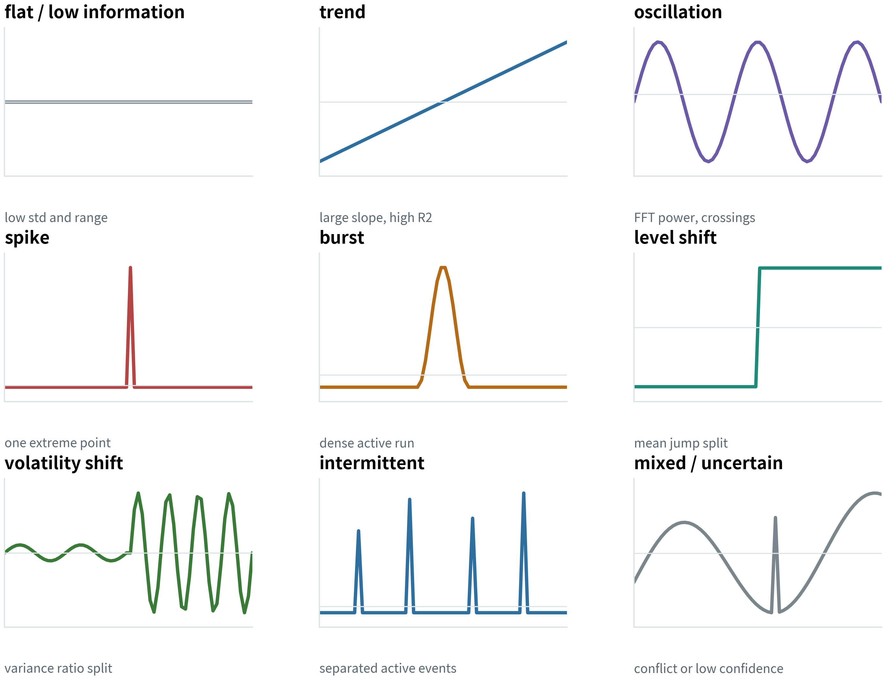

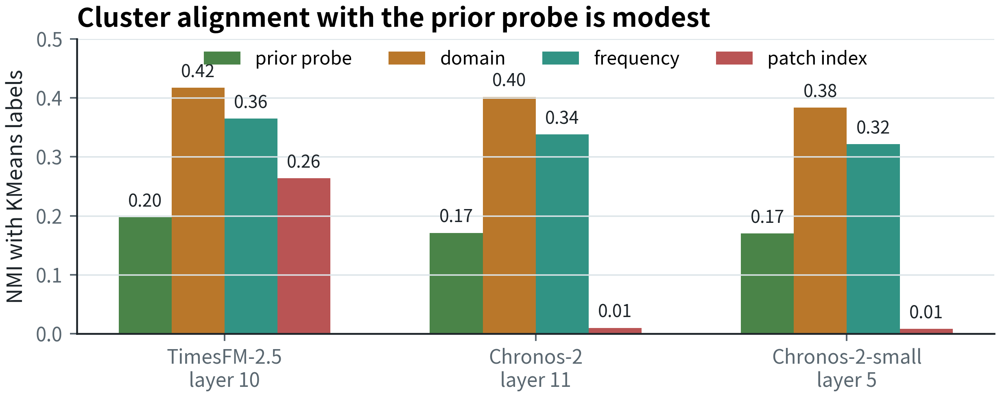

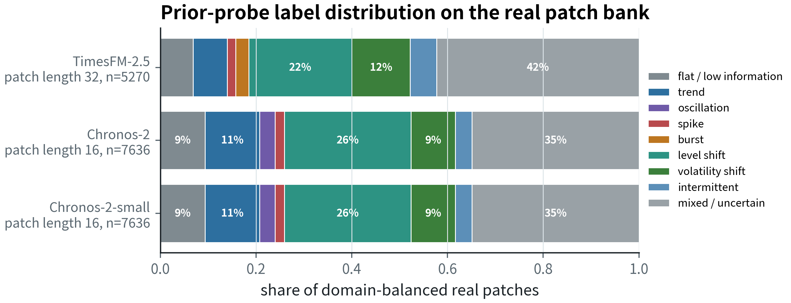

如果你希望一页内完整展示，也可以用合并版：

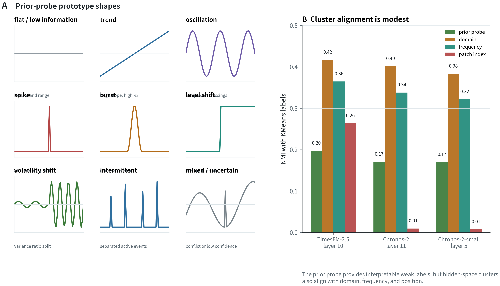

**屏幕文案**

The prior-guided motif probe is not ground truth.

- Prototype shapes make the prior probe interpretable.
- Cluster alignment with the prior probe is modest.
- Domain, frequency, and position can also explain clusters.

**排版提示**

建议拆成两页而不是硬塞一页：

- Slide 3A：左侧放 `fig_prior_probe_prototype_shapes.png`，占页面宽度 62-68%；右侧放三条 bullet。每个 prototype 下方已经有简短判断标准。
- Slide 3B 或 backup：上方放 `fig_prior_probe_alignment_evidence.png`，下方放 `fig_prior_probe_distribution_real_patch_bank.png`。这页回答 “为什么 prior-guided probe 不是 ground truth” 和 “真实数据上每类数量分布如何”。

**口头讲法**

如果老师问“这个 human-prior motif 是不是自己编的”，回答要非常直接：类别语言来自 Time Series Data Mining 常用概念，包括 motif discovery、shapelet、SAX/PAA、change-point detection 和 anomaly/event-run statistics；具体标签不是人工主观贴的，而是 deterministic detectors。

但它不是 ground truth。我们实际检查 hidden-space cluster label 与四类解释变量的一致性：prior probe、domain、frequency、patch index。当前结果里 prior-probe NMI 只有约 0.17-0.20；domain 和 frequency 往往更高，TimesFM-2.5 还存在 patch-index signal。因此 prior-guided motif 只能作为 weak semantic probe / shapelet-inspired explanation anchor，不能作为监督标签或最终 taxonomy。

**可能追问**

阈值从哪里来？  
回答：阈值来自 synthetic calibration，用来保证 patch length 16/32 下的基本可分性。真实数据上我们不把它当最终标签，只作为解释和 prototype-bank seed。完整阈值见 `configs/motif_taxonomy_v0.yaml` 和 backup 图。

为什么 NMI 能证明不是 ground truth？  
回答：如果 prior-guided motif 是真实语义标签，hidden-space clusters 应该主要由它解释；但现在 cluster 与 prior probe 的一致性只是中等偏低，并且 domain/frequency/position 也能解释相当一部分结构。这说明 TSFM representation space 不是 human-prior taxonomy 的一一映射，我们必须采用 discover-first, name-second。

真实数据上 prior-guided prototype 的数量分布如何？  
回答：在 domain-balanced real patch bank 上，`mixed / uncertain` 和 `level shift` 占比较高。TimesFM patch length 32 中 `mixed / uncertain` 约 42%、`level shift` 约 22%、`volatility shift` 约 12%；Chronos-2 和 Chronos-2-small patch length 16 中 `mixed / uncertain` 约 35%、`level shift` 约 26%、`trend` 约 11%。这说明 prior labels 不是平衡监督标签，而是 weak probe。

### Slide 3 Backup. Literature Roots of the Prior Probe

**推荐图片**

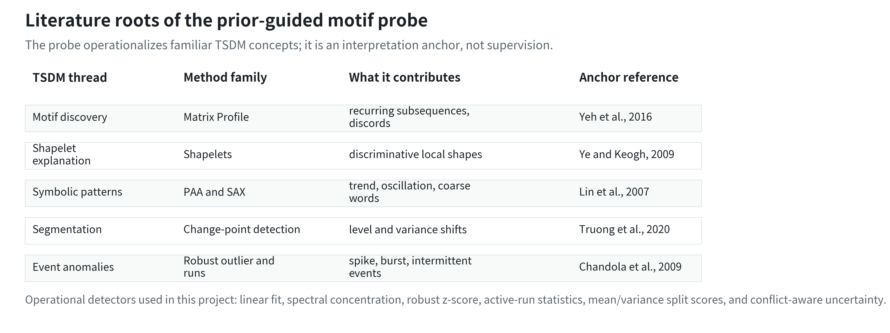

**屏幕文案**

The prior-guided motif probe operationalizes standard TSDM ideas.

- Matrix Profile / motif discovery: recurring subsequences and discords
- Shapelets: discriminative local shapes
- SAX / PAA: symbolic local patterns
- Change-point detection: level and variance shifts
- anomaly/event statistics: spike, burst, intermittent events

**口头讲法**

这里不是从零发明 taxonomy。我们把 Time Series Data Mining 中常见的 subsequence-level language 操作化成 deterministic detectors：linear fit、spectral concentration、robust z-score、active-run statistics、mean/variance split score 和 uncertainty policy。它的作用是解释和校准，不是给 TSFM representation space 提供 ground truth。

**可引用文献**

- Yeh et al., 2016, [`Matrix Profile I: All Pairs Similarity Joins for Time Series`](https://doi.org/10.1109/ICDM.2016.0179)，用于 motif / discord discovery。
- Ye and Keogh, 2009, [`Time Series Shapelets: A New Primitive for Data Mining`](https://doi.org/10.1145/1557019.1557104)，用于 shapelet-like local pattern / prototype explanation。
- Lin et al., 2007, [`Experiencing SAX: A Novel Symbolic Representation of Time Series`](https://doi.org/10.1007/s10618-007-0064-z)，用于 PAA / SAX symbolic local pattern。
- Truong, Oudre and Vayatis, 2020, [`Selective review of offline change point detection methods`](https://doi.org/10.1016/j.sigpro.2019.107299)，用于 level shift / variance shift。
- Chandola, Banerjee and Kumar, 2009, [`Anomaly Detection: A Survey`](https://doi.org/10.1145/1541880.1541882)，用于 spike / burst / intermittent event 类异常语言。

### Slide 4. Discover First, Name Second

**推荐图片**

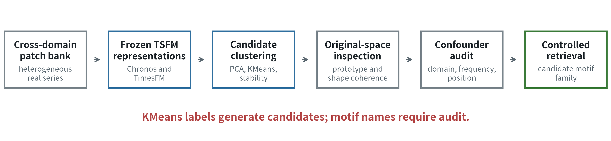

**屏幕文案**

A cluster is not a motif until it survives audits.

Pipeline:

1. Cross-domain patch bank
2. Frozen TSFM representation extraction
3. Candidate generation by PCA/KMeans
4. Original-space prototype inspection
5. Domain/frequency/position confounder audit
6. Controlled retrieval and cross-model validation

**排版提示**

直接用 `fig_discover_first_protocol_flow.png`，占页面宽度 84-90%。这张图已经把流程和 `KMeans labels generate candidates; motif names require audit.` 放进去了，PPT 里只需要加标题。

**口头讲法**

KMeans 只是 candidate generator，不决定最终类别数。命名 motif family 必须回到原空间看 prototype shape，并通过 controlled retrieval 和 confounder audit。

### Slide 5. Hidden Space Has Structure, But Not a Direct Copy of the Probe

**推荐图片**

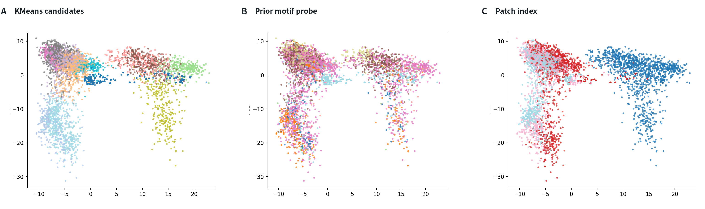

**屏幕文案**

TimesFM-2.5 layer 10 shows structured neighborhoods.

- Clusters exist in hidden space.
- Prior-guided motif labels do not map one-to-one.
- Patch index reveals a real confounder.

**排版提示**

图占页面宽度 82-88%，上方放 1 行结论，下方放 1 行中文 caption。不要在图旁边再堆长解释。

**口头讲法**

A 说明 representation space 不是随机；B 说明模型不是简单复刻 human-prior motif probe；C 说明 TimesFM hidden layer 有明显 position effect，所以后面必须做 position-aware audit。

### Slide 6. Strongest Original-Space Evidence

**推荐图片**

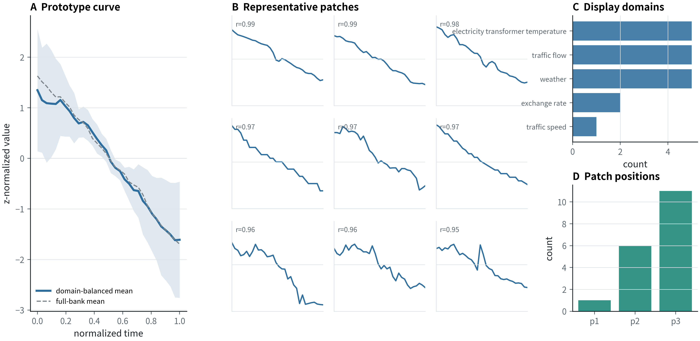

**屏幕文案**

The cleanest current candidate family: strong falling transition

- Coherent original-space shape
- Domain-balanced display subset
- Non-single-position support

**排版提示**

这页是主证据页。图放左侧 70-75% 页面，右侧放 3 条 bullet。caption 明确写：展示子集使用 per-domain cap；完整 prototype bank 里 weather 仍偏多，因此这是 domain-balanced evidence subset，不是最终 taxonomy。

**口头讲法**

我现在只把 strong falling transition 作为最干净的主候选来讲。这里展示的是 domain-balanced subset：每个 source domain 最多取 5 个 prototype，所以不会只被 weather/traffic visually dominate。完整 bank 的 domain skew 仍然保留为风险说明。

### Slide 7. Model-Native Candidate Patches Across TSFMs

**推荐图片**

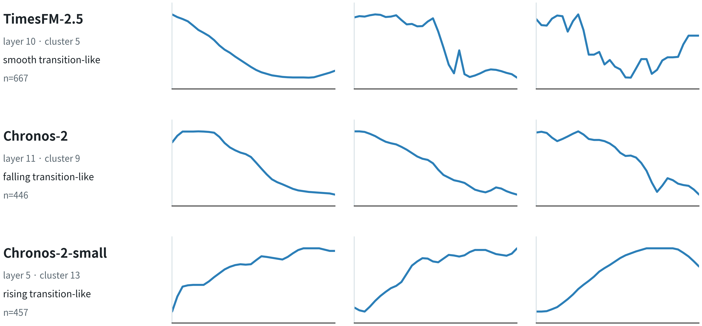

**屏幕文案**

Model-native discovery is required for each TSFM.

- TimesFM-2.5: 32-step patch candidate
- Chronos-2: native 16-step candidate
- Chronos-2-small: native 16-step candidate

**排版提示**

图占页面宽度 78-84%，右侧只放一句结论：`Similar transition-like representatives appear under model-native clustering, but they are not yet validated motif families.` 不要把这页讲成 TimesFM-derived taxonomy transfer。

**口头讲法**

这页是为了回答“是不是把 TimesFM taxonomy 直接迁移到 Chronos”。不是。这里每一行都来自该模型自己的 domain-balanced hidden-space clustering，展示的是 representative examples，不是完整 controlled retrieval validation。Chronos-2-small 也有 native candidate，所以 H3 里 scale diagnosis 有初步证据。

### Slide 8. What Do Other Clusters Look Like?

**推荐图片**

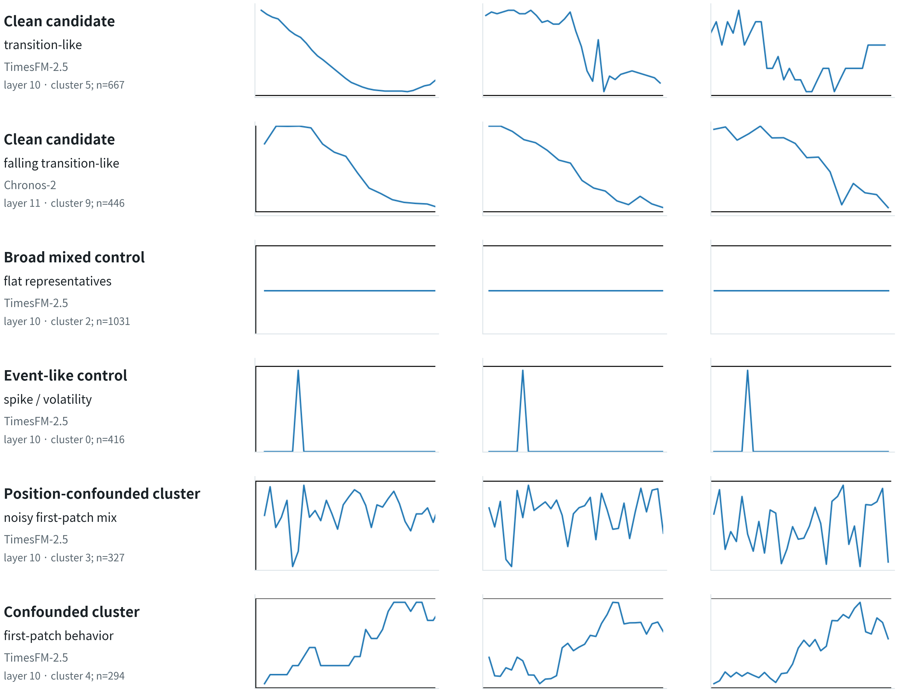

**屏幕文案**

Hidden-space clustering produces multiple outcome types.

- clean candidate families
- broad mixed / event-like controls
- noisy or position-confounded clusters

**排版提示**

这页可以放在 Slide 6/7 后面，也可以作为 backup。标题建议写成“Not every cluster is a motif family”。图占页面 80% 左右，右侧用一句话强调：我们不是只挑最好看的 cluster，而是在区分 candidate motif family、control cluster 和 artifact。

**口头讲法**

老师如果问其它类长什么样，可以直接用这页回答：确实不是所有 cluster 都值得命名。部分 cluster 只是 broad mixed cluster 中的 flat representatives，部分是 spike/volatility control，部分是不稳定 mixed patches，还有 position-confounded artifact。我们的 protocol 的目标就是把这些从真正 candidate motif family 里筛出去。

### Slide 9. Controlled Retrieval

**推荐图片**

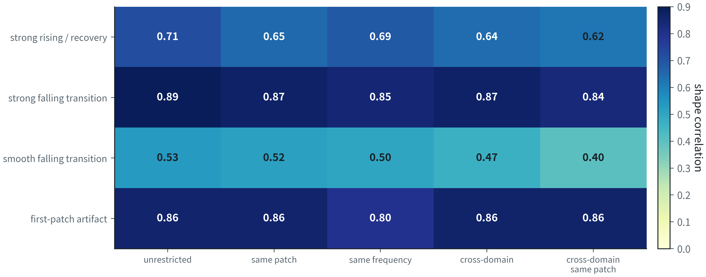

**屏幕文案**

A candidate motif family must survive controlled retrieval.

- unrestricted
- same patch index
- same frequency
- cross-domain
- cross-domain + same patch index

**排版提示**

图左，右侧放解释。重点强调 heatmap 中 `strong falling transition` 更稳定；同时指出 artifact 行为什么不能直接当正例。

**口头讲法**

我们不是只看 unrestricted nearest neighbors。一个候选 family 必须在 same patch index、same frequency、cross-domain 等控制条件下仍然保持 shape coherence。

### Slide 10. Negative Control

**推荐图片**

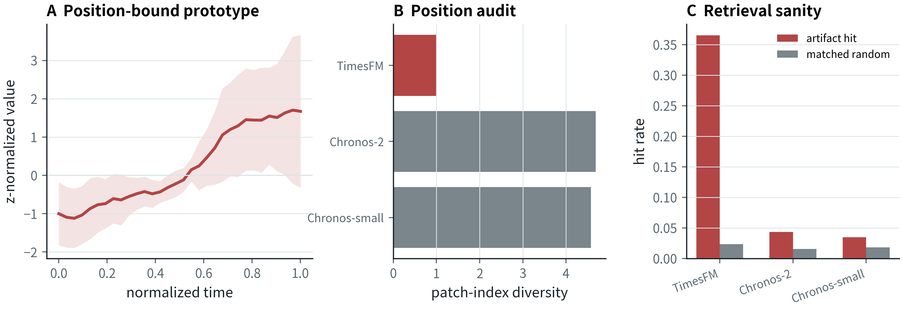

**屏幕文案**

Visual coherence can still be an artifact.

`first-patch behavior`:

- coherent shape
- strong position binding
- not a candidate motif family

**排版提示**

这页是防守页，建议放在 controlled retrieval 后面。红色 artifact 是主动展示的负例，能保护整个方法论。

**口头讲法**

这个负例很重要：它说明我们不会看到 shape 一致就命名 motif。position-bound cluster 只能作为 artifact control。

### Slide 11. Representation Lineage for H2

**推荐图片**

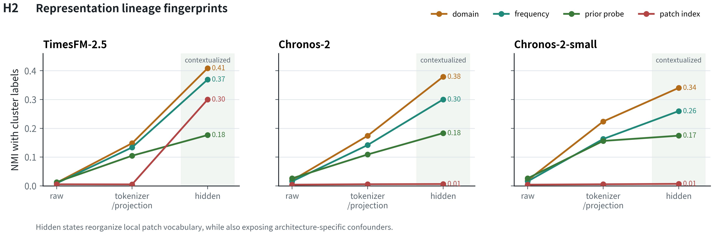

**屏幕文案**

Tokenizer/projection and hidden states answer different questions.

- tokenizer/projection: local patch vocabulary
- hidden states: contextualized representation
- hidden states require confounder-aware audit

**排版提示**

把这页明确标成 “Evidence for H2”。图建议占页面宽度 82-88%，右侧只放一句话：`hidden states reorganize local patch vocabulary, but confounders also become visible.` 如果担心 NMI 概念老师没马上进入状态，先说 NMI 只是衡量 cluster label 与 metadata/probe label 的一致性。

**口头讲法**

这页回答 H2。TimesFM hidden state 的 patch-index NMI 明显升高，说明 contextualization 同时带来了 position effect；Chronos hidden state 的 position confounding 低，但 domain/frequency encoding 更强。

### Slide 12. Cross-Model Validation for H3

**推荐图片**

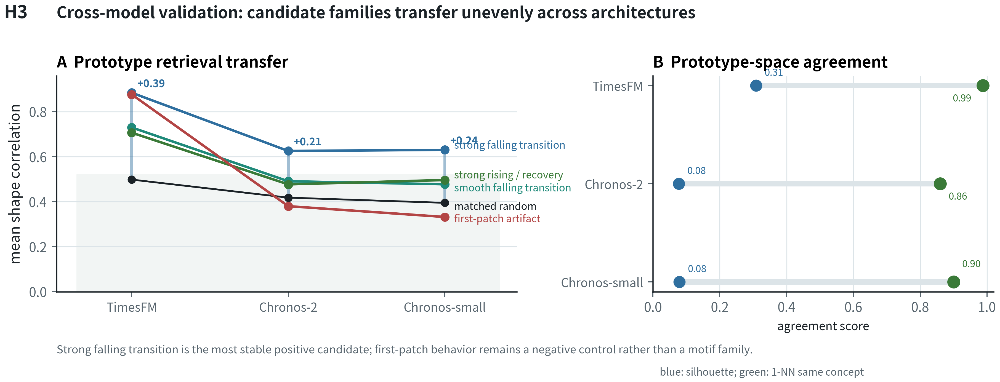

**屏幕文案**

Do TimesFM-derived prototypes transfer to Chronos?

- `strong falling transition` transfers best
- `rising/recovery` is weaker in Chronos
- Full Chronos-native controlled retrieval is still needed

**排版提示**

图占页面宽度 82-88%，不要再放长表格。左侧 panel 讲 prototype retrieval transfer，右侧 panel 讲 prototype-space agreement。不要说已经证明了 universal taxonomy；说这是 cross-model sanity check。

**口头讲法**

falling transition 在 TimesFM、Chronos-2、Chronos-2-small 中都高于 matched random，是当前最稳的 cross-model candidate。但 Chronos patch length 是 16，TimesFM 是 32，所以不能只用 TimesFM-derived prototypes 下结论，下一步需要 Chronos-native discovery。

### Slide 13. Takeaways and Next Steps

**屏幕文案**

Current claim:

TSFM hidden space is not a direct copy of human-prior motif labels. It contains model-derived candidate motif families, but they must be audited for domain, frequency, and position confounding.

Next:

1. Expand domain-balanced prototype bank beyond the current display subset
2. Multi-K / hierarchical stability
3. Direction-flip control
4. Full Chronos-native controlled retrieval

**排版提示**

不要放图，做成结束页。中间放大 current claim，下面放下一步。

**口头讲法**

目前最稳的说法不是“我们发现最终 taxonomy”，而是“我们建立了一个 model-derived motif family discovery protocol，并找到一个最干净的 candidate：strong falling transition”。

## 3. Backup 素材

### Backup A. Full Prior-Probe Thresholds

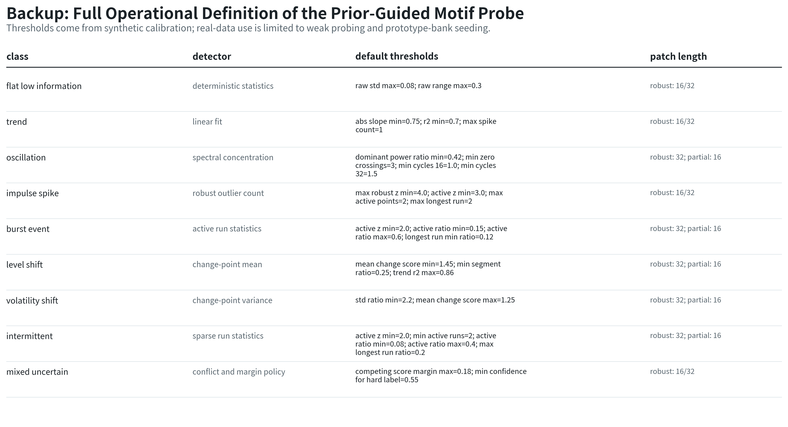

用于回答：每个 human-prior motif 到底如何数学定义？阈值在哪里？是否可复现？

### Backup B. Candidate Family Quality

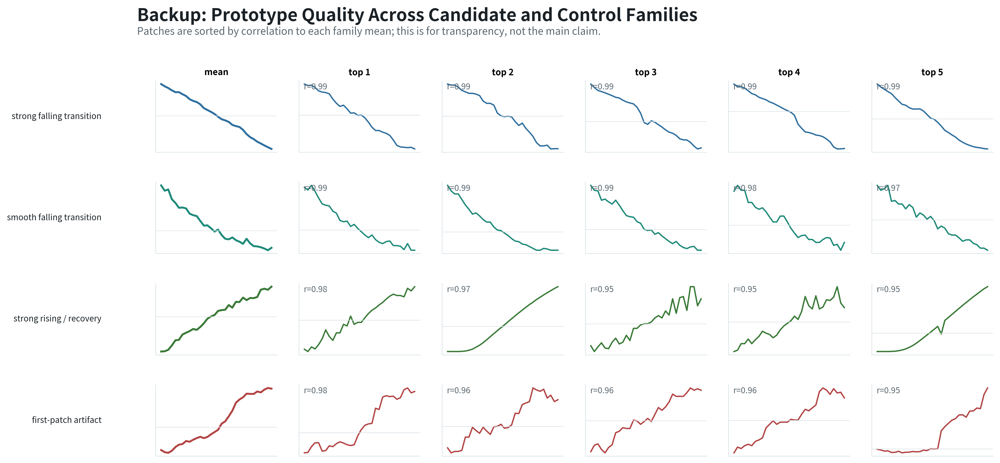

用于回答：为什么主讲只展示 `strong falling transition`？因为其他候选 family 的原空间同类性更弱，暂时不能同等 claim。

### Backup C. Layer Choice

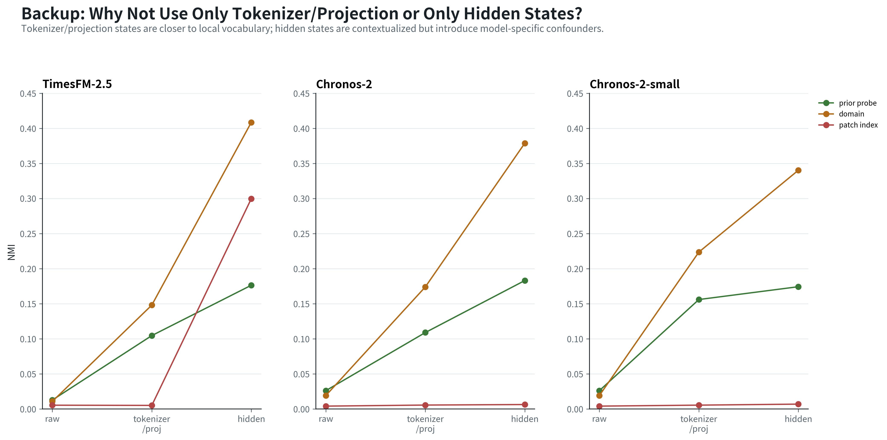

用于回答：为什么不用 transformer 前的 projection embedding？为什么 hidden layer 会有 position artifact？

### Backup D. Candidate Family Inventory

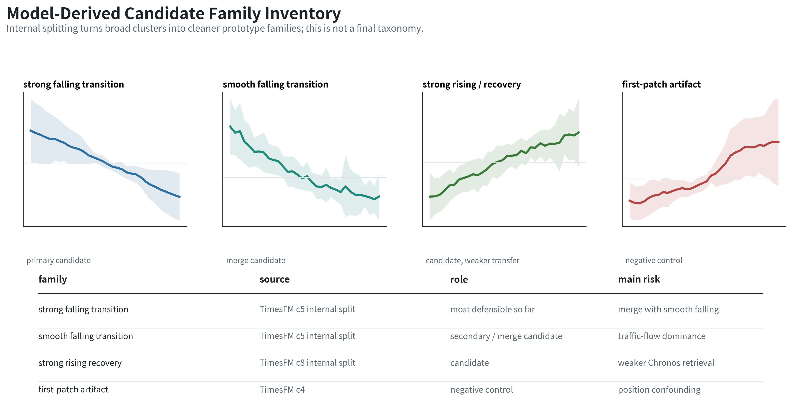

用于讨论：未来是否可以构建新的 model-derived motif taxonomy。注意措辞是 `candidate family inventory`，不是 final taxonomy。

## 4. 老师可能追问与建议回答

### Q1. human-prior motifs 是怎么数学定义的？是自己瞎编的吗？

不是。类别语言来自 Time Series Data Mining 中常见的 local pattern 和 subsequence explanation 语言：Matrix Profile / motif discovery、shapelets、SAX/PAA symbolic patterns、change-point detection、anomaly/event-run statistics。我们做的是把这些概念操作化成 deterministic detectors，例如 linear fit、FFT concentration、robust outlier count、active-run statistics、mean/variance split score。

### Q2. 那这些阈值有什么依据？

阈值是 synthetic calibration 的结果，用来保证 patch length 16 和 32 下有基本可分性。它们不作为真实数据 ground truth，只作为 weak semantic probe。真实结论依赖 original-space inspection、controlled retrieval 和 confounder audit。

### Q3. Slide 6 的 falling transition 会不会只是 weather domain 主导？

这是当前风险之一，所以我们不能说 final taxonomy。目前主图已经用了 per-domain cap 的 domain-balanced display subset；但 full prototype bank 里 weather 仍偏多，后续需要扩展为真正 full-scale domain-balanced prototype bank / full audit。

### Q4. PCA/KMeans 的 K 会不会任意？

KMeans 只是 candidate generation，不是最终 motif 类别数。最终命名依据是 shape coherence、controlled retrieval、confounder audit、cross-model sanity check。下一步会补 multi-K / hierarchical stability。

### Q5. 为什么不直接用 tokenizer/projection embedding 做 clustering？

tokenizer/projection 更适合分析 local patch vocabulary；hidden states 更适合分析 contextualized motif families。两者回答不同问题。我们的 H2 正是比较 raw -> tokenizer/projection -> hidden 的 representation lineage。

### Q6. 为什么不用 `v0/v1` 直接讲？

`v0/v1` 是仓库内部命名，老师第一次听会觉得突兀。主 PPT 建议用 `prior-guided motif probe` 和 `model-derived candidate motif families`。如果老师追问文件命名，再说内部把前者记作 v0、后者记作 v1 pilot。

## 5. 明天汇报时最稳的三句话

1. “Human-prior motif labels are weak probes, not ground truth.”
2. “The strongest evidence is not the PCA plot, but original-space prototype coherence plus controlled retrieval and confounder audit.”
3. “The cleanest current candidate is `strong falling transition`; the negative control shows why confounder audit is necessary.”
