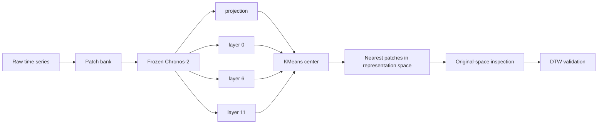
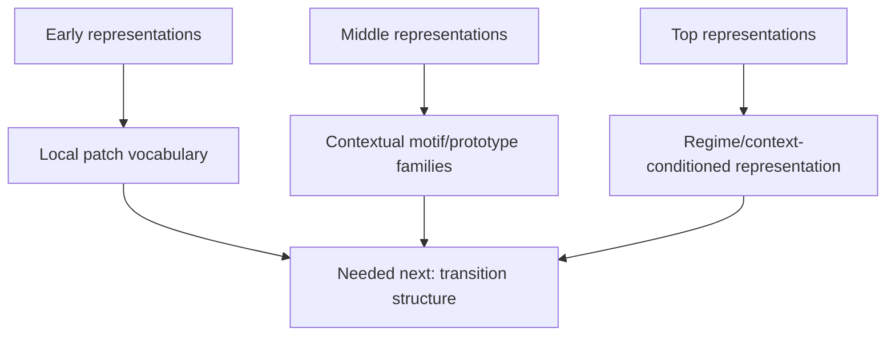

# Notion 周汇报：Chronos-2 的 patch token 到底还保留了什么？

> 这版不是 PPT，也不做过度包装。  
> 我们直接用当前实验的原图，把上周 meeting 后留下的三个问题讲清楚。

<b>这周最想和老师确认的一句话：</b> 
Chronos-2 的 early representations 仍然保留 single-patch 的 local temporal information；但越往中高层走，representation 越稳定、也越 contextualized。下一步设计 TSFM 时，可能不能只做更大的 Transformer，而要让模型显式地区分 <b>local patch vocabulary</b>、<b>contextual motif/prototype family</b> 和 <b>prototype transition structure</b>。

## 0. 先说人话版结论

上周老师问的核心其实有三个。

第一，**single patch 里面的信息是不是还在？**  
我们的答案是：在 `projection` 和 `layer_0` 里还在，而且比较明显。因为这些层的 KMeans center-nearest patches 回到原始时序空间后，还能看到比较清楚的 local shape。到了 `layer_6` 和 `layer_11`，cluster 仍然稳定，但很多 cluster 已经不再是单纯 raw-shape motif，而是混入了 context、domain、frequency 或 cadence-style information。

第二，**cluster 的例子应该怎么看？**  
我们现在统一按老师建议：用 `KMeans center` 作为 cluster center，在 representation space 找离 center 最近的 patches，再回到 original time-series space 画出来。也就是说，图里的 example 不是手挑的“好看样本”，而是模型 representation geometry 里最靠近 cluster center 的样本。

第三，**这些结果对设计新 TSFM 有什么启发？**  
我的理解是：patch-based TSFM 不应该只被看作一个把 patch 丢进 Transformer 的 pattern recognizer。更好的设计可能需要显式建模三层东西：

1. early layer 的 `local patch vocabulary`；
2. middle layer 的 `contextual motif/prototype family`；
3. 连续 patch/prototype 之间的 `transition structure`。

这也和 `Position: Why a Dynamical Systems Perspective is Needed to Advance Time Series Modeling` 的观点接上了：time series 不是一堆静态 pattern 的集合，而是 underlying dynamical system 的观测。motif 有用，但 motif 怎么转移更重要。

## 1. 我们这周其实是在回答什么问题

上周以后，我们把问题收窄了：

- 只看 `Chronos-2`；
- 看 `projection`, `layer_0`, `layer_6`, `layer_11`；
- 不 fine-tune，不改权重；
- 用 macro-domain balanced sampling；
- 在 representation space 里用 Euclidean/KMeans 找 candidate clusters；
- 回到 original time-series space 里看 center-nearest patches；
- 再用 DTW 去审计原空间 shape coherence。

这里最重要的边界是：**KMeans cluster 不是 motif 名字。**  
它只是告诉我们：在 Chronos-2 的 representation space 里，模型觉得哪些 patch tokens 是近的。

## 2. K 怎么选：不是为了凑一个好看的图

我们这次没有只用 silhouette，也没有为了画图随便定 K。K 的选择是一个 representation-space operating point，目的是支持 layer-wise comparison。

最终：

- shared K: `6`
- `layer_6` 的 layer-specific K: `10`

这张图的读法很简单：

- `K=6` 适合四层横向比较；
- `layer_6` 更喜欢 `K=10`，说明中层可能有更细的 contextual substructure；
- 但 `K=10` 也不是最终 taxonomy，只是 layer-specific diagnostic。

所以如果老师问 “K=6 和 K=10 哪个对”，我会这样回答：

> K=6 是为了比较 projection 到 layer 11 的共同坐标系；layer_6 K=10 是为了说明 middle layer 可能需要更细的划分。它们都不是 final motif taxonomy 的类别数。

## 3. 问题一：single patch 还保留 independent local information 吗？

我觉得答案是：**early layers 里保留了，但中高层开始被 context 重写。**

先看总指标。

这张图不要过度解读成 “哪一层最好”。更合适的读法是：

- `projection` 和 `layer_0` 更接近 local patch vocabulary；
- `layer_6` 和 `layer_11` seed stability 更高；
- 但 `layer_6` / `layer_11` 的 macro/frequency confounding 也更明显；
- 所以中高层可能更像 contextual representation，而不是纯 single-patch shape space。

换句话说：  
**single patch 的 local information 没有在进入 Chronos-2 后立刻消失；但 Transformer 层确实逐步把它和 context 混在一起。**

## 4. 问题二：KMeans center-nearest examples 长什么样？

下面几张就是按老师建议画的：  
**KMeans center as center, nearest points as examples.**

图里每一行是一个 cluster，里面的曲线是离该 cluster center 最近的 raw patches。cluster 只叫 `C0`, `C1`, ...，不直接命名 motif。

这里我采用一个简单规则：`projection`、`layer_0`、`layer_11` 用各自最佳 K，也就是 `K=6`；`layer_6` 用它自己的最佳 K，也就是 `K=10`。shared `K=6` 只作为层间横向比较的背景，不再作为 layer 6 的主展示图。

### 4.1 Projection：最接近 tokenizer/projection 后的 local patch geometry

我的读法：

- 有些 cluster 回到原空间后确实有比较一致的 local shape；
- 这说明 projection 层不是纯噪声 embedding，它已经把某些 patch-level pattern 分开了；
- 但也有 weak cluster，所以不能直接说所有 cluster 都是 motif。

### 4.2 Layer 0：early transformer layer 仍然保留 local vocabulary

我的读法：

- `layer_0` 仍然能看到不少 local shape coherence；
- 这支持老师的 intuition：early layers 更适合看 spike、oscillation、trend、transition 这类 local information；
- 如果我们后面要做 prototype bank，`projection` 和 `layer_0` 是更合理的起点。

### 4.3 Layer 6：最佳 K=10，下钻看 contextual substructure

我的读法：

- `layer_6` 的最佳 K 是 `10`，所以这里用 `K=10` 作为主图；
- 这个图比 shared `K=6` 更适合看 middle layer 内部的细分结构；
- 有些子 cluster 看起来更像 coherent prototype，有些仍然 weak/confounded；
- 所以我的解释是：layer 6 很可能是 local vocabulary 被重组为 contextual motif/prototype subfamilies 的过渡层；
- 但 `K=10` 仍然只是 layer-specific diagnostic，不是最终 taxonomy。

### 4.4 Layer 11：更稳定，但更难直接解释成 raw motif

我的读法：

- layer 11 的 representation 很稳定；
- 但它不一定是最适合看 single-patch motif 的地方；
- 它可能更适合看 context / regime / domain-conditioned representation。

## 5. 为什么还要看 macro-domain filtered examples？

只看 center-nearest examples 有一个风险：nearest patches 可能来自少数几个 dataset 或 macro-domain。老师之前也指出，按 domain 画出来的 examples 有时不好看，这可能不是模型没学到，而是 sampling 和 forced nearest 的问题。

所以我们现在看 confidence-filtered macro-domain evidence：不是每个 cell 都强行找一个 nearest，而是只展示更可信的 match。空白或弱 cell 本身也是信息。

我的读法：

- 如果一个 cluster 在多个真实 macro-domain 中都有可信 match，它更可能是 cross-domain temporal commonality；
- 如果只在单一 domain 出现，就更像 domain-specific pattern；
- 如果 match 很弱，就不要硬说它是 motif。

## 6. DTW 的作用：不是替代 KMeans，而是防止原空间解释错

我们现在的原则是：

- representation space：用 Euclidean / KMeans，因为 hidden states 是向量；
- original time-series space：用 DTW，因为 spike、burst、oscillation 可能有时间错位。

也就是说：

> Euclidean tells us what Chronos groups together.  
> DTW tells us whether those grouped patches are shape-coherent in original time.

这张图说明，有些 cluster 在 DTW 下确实更 coherent，但也有一些 cluster 即使用 DTW 也不行。后者说明问题不只是距离函数，而是 cluster 本身混杂。

下面这张图更直观：同一个 cluster，用 representation center、raw Euclidean medoid、correlation medoid、DTW medoid 选 prototype，看到的例子会不一样。

这件事对我们很重要，因为如果未来要提出 motif/prototype family，不能只拿 representation center-nearest 图说话，还要通过 DTW validation。

## 7. 这些结果对设计新的 TSFM 有什么启发？

我觉得现在能比较稳地提出一个设计猜想，但不能说已经证明。

### 7.1 当前模型像是学到了三层东西

人话版：

- early layer 里有 local vocabulary；
- middle layer 里开始出现 contextual grouping；
- top layer 更像和全局 context / domain / cadence 相关；
- 但现在还缺一件事：这些 prototype states 之间如何转移。

### 7.2 和 dynamical systems perspective 的连接

参考 `Position: Why a Dynamical Systems Perspective is Needed to Advance Time Series Modeling`，真实 time series 更像 dynamical system 的观测，而不是静态 motif bag。

所以我会把下一步猜想说成：

<b>Dynamical Prototype State Hypothesis</b> 
更好的 patch-based TSFM 不应该只学习 local motif prototypes，还应该学习这些 prototype states 之间的 transition geometry。这个 transition geometry 如果是真实的 shared temporal knowledge，就应该在跨 domain、OOD/regime shift 和 long-term statistics 上有帮助。

这不是玄学。它能直接指导实验和模型设计。

### 7.3 可以怎么设计新 TSFM

我觉得有三个比较自然的方向：

1. **Prototype-aware tokenizer / projection**  
   在 early representation 附近加入 prototype bank，让 patch token 不只是 dense vector，也能对齐到可解释的 local prototype states。

2. **Transition-aware objective**  
   对连续 patches 的 prototype sequence 建模，不只预测下一个数值，也预测下一个 prototype state 或 transition distribution。

3. **Confounder-aware representation learning**  
   训练时显式压制 domain/frequency/position confounding，让模型学到更接近 cross-domain temporal commonality 的 transition structure。

## 8. 现在能 claim 什么，不能 claim 什么

### 可以比较稳地说

- Chronos-2 early representations 仍保留 single-patch local information；
- `projection` / `layer_0` 比 `layer_6` / `layer_11` 更适合看 local motif/prototype vocabulary；
- `layer_6` 可能是 local vocabulary 到 contextual family 的过渡层；
- representation-space clustering 必须回到 original-space inspection 和 DTW validation 才能解释；
- 这些结果支持一个新的 TSFM 设计猜想：prototype states + transition geometry。

### 现在还不能说

- 不能说我们已经发现 final motif taxonomy；
- 不能说 KMeans cluster 就是 motif；
- 不能说 layer 6 K=10 是最终类别数；
- 不能说 DTW 一定比所有方法都好；
- 不能说 transition geometry 已经被 Chronos-2 学到了。现在只能说：已有结果提示这是一个值得验证的方向。

## 9. 建议 meeting 里怎么讲

我建议按下面这个顺序讲，不要从技术细节开始：

1. 老师上周的问题是：single patch 还有没有 local information？
2. 我们用 Chronos-2 的 `projection/layer_0/layer_6/layer_11` 做 layer-wise audit。
3. 早层 center-nearest 原图说明 local vocabulary 还在。
4. 中高层稳定但更 contextualized，所以不能简单命名 raw motif。
5. KMeans center-nearest 是按 representation geometry 选 example，不是手挑。
6. DTW 告诉我们：原空间解释必须考虑 time shift。
7. 因此下一步不是继续画更多 motif，而是验证 prototype state transition。
8. 这可以指导 TSFM 设计：prototype-aware + transition-aware + confounder-aware。

最后可以用一句话收住：

> 我们现在不是在说 Chronos-2 已经学到了完整的“时序语言”；更准确地说，它的 early layers 里有 vocabulary 的证据，而下一步要验证 grammar，也就是 prototype states 的 transition geometry。

## 10. 文件索引

本页使用的都是当前实验原图：

- `outputs/chronos_multilayer_validation/figures/k_selection_summary.png`
- `outputs/chronos_multilayer_validation/figures/layer_comparison_summary.png`
- `outputs/chronos_multilayer_validation/figures/projection_main_center_nearest.png`
- `outputs/chronos_multilayer_validation/figures/layer_0_main_center_nearest.png`
- `outputs/chronos_multilayer_validation/figures/layer_6_k10_center_nearest.png`
- `outputs/chronos_multilayer_validation/figures/layer_11_main_center_nearest.png`
- `outputs/chronos_multilayer_validation/figures/layer_0_main_macro_domain_filtered.png`
- `outputs/chronos_multilayer_validation/figures/layer_6_k10_macro_domain_filtered.png`
- `outputs/distance_metric_ablation/figures/distance_metric_heatmap.png`
- `outputs/distance_metric_ablation/figures/prototype_metric_comparison_layer_0_k6.png`
