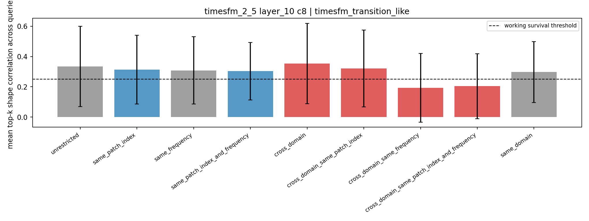
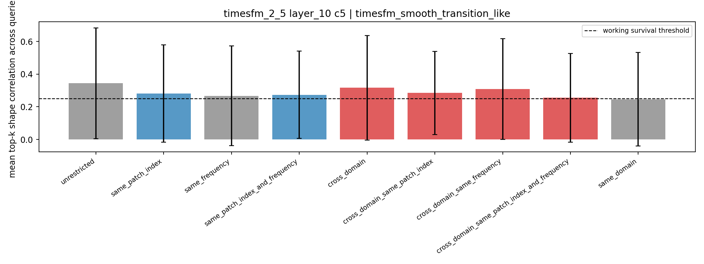
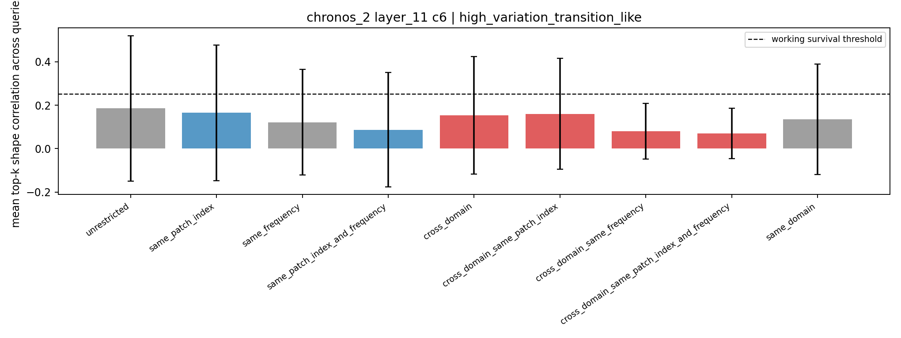
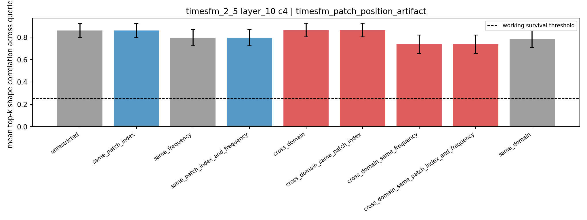

# Cluster-Level Controlled Validation: Multi-Query + Position/Frequency-Aware

## 1. 目的

本轮验证是对 `docs/cluster_card_review_report.md` 的进一步审计：上一轮每个 cluster 主要依赖一个 medoid query，因此容易被单个 query 的形态偶然性影响。本轮把单位升级为 **cluster-level multi-query retrieval**，每个 cluster 选取 `16` 个 diverse medoid-like queries，并加入更严格的 position/frequency-aware retrieval 条件。

本轮仍然不定义最终 taxonomy，只判断哪些候选 cluster 在控制 `patch_index`、`frequency`、`domain` 后仍有稳定 shape-level coherence。

运行命令：

```bash
.venv/bin/python scripts/run_cluster_level_validation.py \
  --windows-per-dataset 100 \
  --domain-balanced-patches 700 \
  --batch-size 96 \
  --queries-per-cluster 16 \
  --top-k 10 \
  --target-scope all
```

输出：

- `scripts/run_cluster_level_validation.py`
- `outputs/cluster_validation/cluster_level_validation_summary.json`
- `outputs/cluster_validation/figures/`

本轮共生成 `14` 张图：每个 cluster 一张 condition bar plot 和一张 multi-query retrieval examples。

## 2. 验证设计

每个 cluster 选 `16` 个 query。query 不是随机选，而是从 cluster center 附近按 domain、frequency、patch index 做轻量多样化，避免只看同一种来源的 medoids。

每个 query 在 PCA representation space 中做 top-k retrieval，`top_k=10`。每个条件下记录：

- `mean_shape_correlation`
- `positive_shape_fraction`: top-k 中 shape correlation > `0.25` 的比例
- `taxonomy_v0_agreement`
- `domain_diversity`
- `frequency_diversity`
- `patch_index_diversity`

Retrieval 条件包括：

- `unrestricted`
- `same_patch_index`
- `same_frequency`
- `same_patch_index_and_frequency`
- `cross_domain`
- `cross_domain_same_patch_index`
- `cross_domain_same_frequency`
- `cross_domain_same_patch_index_and_frequency`
- `same_domain`

这里使用 `0.25` 作为 working survival threshold，只是为了筛查候选，不是统计显著性或最终判定标准。

## 3. 主要结论

### 3.1 最稳的候选：`TimesFM-2.5 layer_10 c8`

Figures:

- `outputs/cluster_validation/figures/timesfm_2_5_layer_10_c8_timesfm_transition_like_condition_bars.png`
- `outputs/cluster_validation/figures/timesfm_2_5_layer_10_c8_timesfm_transition_like_query_examples.png`



关键结果：

| condition | mean shape corr | positive fraction | taxonomy-v0 agreement | domain div | freq div | patch div |
|---|---:|---:|---:|---:|---:|---:|
| `unrestricted` | 0.334 | 0.550 | 0.319 | 2.94 | 2.81 | 2.31 |
| `same_patch_index` | 0.313 | 0.544 | 0.306 | 3.38 | 3.12 | 1.00 |
| `same_frequency` | 0.308 | 0.519 | 0.306 | 1.25 | 1.00 | 2.56 |
| `cross_domain` | 0.354 | 0.581 | 0.250 | 3.50 | 3.06 | 2.75 |
| `cross_domain_same_patch_index` | 0.321 | 0.550 | 0.225 | 3.50 | 3.19 | 1.00 |
| `cross_domain_same_frequency` | 0.193 | 0.420 | 0.390 | 1.10 | 1.00 | 2.80 |

判断：

`TimesFM-2.5 layer_10 c8` 是目前最稳的 model-derived concept candidate。它在 `same_patch_index` 和 `cross_domain_same_patch_index` 下都超过 working threshold，说明它不是单纯由 patch position 造成的。它在 `cross_domain` 下甚至比 unrestricted 更高，说明多个 domain 中确实存在相似的 transition-like representation neighborhood。

但它没有完全通过 `cross_domain_same_frequency`，这说明它可能仍部分依赖 cadence/frequency，或者相同 frequency 的跨 domain 候选数量不足。临时命名仍可保留为 `smooth_rising_transition`，但需要标注为 **position-robust, partially frequency-sensitive**。

### 3.2 意外转正但方差很大：`TimesFM-2.5 layer_10 c5`

Figures:

- `outputs/cluster_validation/figures/timesfm_2_5_layer_10_c5_timesfm_smooth_transition_like_condition_bars.png`
- `outputs/cluster_validation/figures/timesfm_2_5_layer_10_c5_timesfm_smooth_transition_like_query_examples.png`



关键结果：

| condition | mean shape corr | positive fraction | taxonomy-v0 agreement | domain div | freq div | patch div |
|---|---:|---:|---:|---:|---:|---:|
| `unrestricted` | 0.344 | 0.463 | 0.288 | 4.38 | 3.88 | 2.50 |
| `same_patch_index` | 0.281 | 0.425 | 0.319 | 4.56 | 3.94 | 1.00 |
| `same_frequency` | 0.267 | 0.425 | 0.387 | 1.69 | 1.00 | 2.56 |
| `cross_domain` | 0.316 | 0.456 | 0.256 | 4.00 | 3.69 | 2.56 |
| `cross_domain_same_patch_index` | 0.285 | 0.469 | 0.288 | 4.25 | 3.88 | 1.00 |
| `cross_domain_same_frequency` | 0.309 | 0.473 | 0.245 | 1.36 | 1.00 | 2.91 |
| `cross_domain_same_patch_index_and_frequency` | 0.255 | 0.464 | 0.282 | 1.36 | 1.00 | 1.00 |

判断：

上一轮单 query 中，`c5` 的 shape correlation 全部为 `0.000`，看起来像 medoid query 失效或 heterogeneous pool。本轮 multi-query 后，它反而在多种控制条件下超过 threshold，说明 `c5` 不能简单丢弃。

但它的标准差很大，说明 cluster 内部很可能包含多个 sub-concepts。现在更合理的判断是：`c5` 是一个 **heterogeneous but real smooth-transition pool**，需要做 cluster 内二次聚类或 multi-prototype naming，而不是直接命名成一个单一 temporal concept。

### 3.3 `Chronos-2 layer_11 c6` 被降级：单 query 乐观，多 query 不稳

Figures:

- `outputs/cluster_validation/figures/chronos_2_layer_11_c6_high_variation_transition_like_condition_bars.png`
- `outputs/cluster_validation/figures/chronos_2_layer_11_c6_high_variation_transition_like_query_examples.png`



关键结果：

| condition | mean shape corr | positive fraction | taxonomy-v0 agreement | domain div | freq div | patch div |
|---|---:|---:|---:|---:|---:|---:|
| `unrestricted` | 0.185 | 0.456 | 0.250 | 3.56 | 3.31 | 4.25 |
| `same_patch_index` | 0.165 | 0.475 | 0.263 | 4.06 | 3.50 | 1.00 |
| `same_frequency` | 0.121 | 0.431 | 0.306 | 1.44 | 1.00 | 4.75 |
| `cross_domain` | 0.154 | 0.444 | 0.256 | 3.44 | 3.06 | 4.62 |
| `cross_domain_same_patch_index` | 0.160 | 0.463 | 0.225 | 3.81 | 3.38 | 1.00 |
| `cross_domain_same_frequency` | 0.080 | 0.262 | 0.450 | 1.00 | 1.00 | 5.75 |

判断：

这是本轮最重要的修正之一。上一轮单 medoid retrieval 对 `c6` 的印象偏正面，但 multi-query 后，所有 mean shape correlation 都低于 `0.25`。虽然 positive fraction 约 `0.44-0.48`，说明一部分 query 确实能找回 transition-like patches，但 cluster-level 平均并不稳。

因此 `Chronos-2 layer_11 c6` 不应再被称为强 temporal concept。更合适的解释是：它可能包含一个 transition-like subcluster，但整个 `c6` 是 heterogeneous transition pool。下一步若继续研究 Chronos，应该对 `c6` 做二次聚类或 prototype splitting，而不是直接纳入 taxonomy v1。

### 3.4 `Chronos-2 layer_6 c2` 确认为 frequency/domain-mediated

Figures:

- `outputs/cluster_validation/figures/chronos_2_layer_6_c2_midlayer_transition_like_condition_bars.png`
- `outputs/cluster_validation/figures/chronos_2_layer_6_c2_midlayer_transition_like_query_examples.png`

关键结果：

| condition | mean shape corr | positive fraction | taxonomy-v0 agreement | domain div | freq div | patch div |
|---|---:|---:|---:|---:|---:|---:|
| `unrestricted` | 0.237 | 0.481 | 0.294 | 3.19 | 3.19 | 4.31 |
| `same_patch_index` | 0.219 | 0.456 | 0.263 | 3.88 | 3.62 | 1.00 |
| `same_frequency` | 0.252 | 0.469 | 0.237 | 1.25 | 1.00 | 4.88 |
| `cross_domain` | 0.123 | 0.363 | 0.219 | 3.62 | 3.56 | 4.69 |
| `cross_domain_same_patch_index` | 0.112 | 0.338 | 0.250 | 4.00 | 3.94 | 1.00 |
| `same_domain` | 0.261 | 0.500 | 0.244 | 1.00 | 1.19 | 5.00 |

判断：

`c2` 在 `same_frequency` 和 `same_domain` 下较高，但 `cross_domain` 和 `cross_domain_same_patch_index` 明显下降。这支持之前判断：`Chronos-2 layer_6` 中层 cluster 更多是在编码 frequency/domain-style，而不是跨域 temporal concept。它可以作为论文里的中层混杂案例。

### 3.5 `Chronos-2 layer_11 c1` 仍是宽泛池，不是明确 concept

Figures:

- `outputs/cluster_validation/figures/chronos_2_layer_11_c1_transition_like_cross_domain_condition_bars.png`
- `outputs/cluster_validation/figures/chronos_2_layer_11_c1_transition_like_cross_domain_query_examples.png`

所有主要条件的 mean shape correlation 都在 `0.01-0.13` 附近，`cross_domain=0.099`，`cross_domain_same_patch_index=0.064`。这说明 `c1` 虽然大且低混杂，但不是一个 shape-coherent temporal concept，更像 broad nonstationary pool。

### 3.6 Negative controls 仍然有必要

#### `Chronos-2 layer_6 c7`: synthetic Gaussian artifact

Figures:

- `outputs/cluster_validation/figures/chronos_2_layer_6_c7_gaussian_noise_artifact_condition_bars.png`
- `outputs/cluster_validation/figures/chronos_2_layer_6_c7_gaussian_noise_artifact_query_examples.png`

它没有 strong survival signal，同时 cluster 统计仍显示 `simulated Gaussian data` / `None frequency` dominated。这个 cluster 应作为 synthetic artifact control，而不是 concept candidate。

#### `TimesFM-2.5 layer_10 c4`: patch-position artifact

Figures:

- `outputs/cluster_validation/figures/timesfm_2_5_layer_10_c4_timesfm_patch_position_artifact_condition_bars.png`
- `outputs/cluster_validation/figures/timesfm_2_5_layer_10_c4_timesfm_patch_position_artifact_query_examples.png`



这是一个关键反例：

| condition | mean shape corr | patch div |
|---|---:|---:|
| `unrestricted` | 0.860 | 1.00 |
| `same_patch_index` | 0.860 | 1.00 |
| `cross_domain` | 0.864 | 1.00 |
| `cross_domain_same_patch_index` | 0.864 | 1.00 |
| `cross_domain_same_frequency` | 0.736 | 1.00 |

它几乎在所有条件下都高度相似，但 `patch_index` 永远是 `0`。这说明 **高 cross-domain shape correlation 本身还不够**；必须同时检查 patch-index distribution。`c4` 应作为 TimesFM position artifact 的核心 negative control 写进实验设计。

## 4. 对上一轮判断的更新

本轮 multi-query validation 改变了我们对几个 cluster 的置信度：

| cluster | 上一轮判断 | 本轮更新 |
|---|---|---|
| `TimesFM-2.5 layer_10 c8` | 强候选 | 继续保留，当前最稳 |
| `TimesFM-2.5 layer_10 c5` | 不可靠 / heterogeneous | 转为值得拆分研究的 heterogeneous smooth-transition pool |
| `Chronos-2 layer_11 c6` | Chronos 最强候选 | 降级为 heterogeneous transition pool，单 query 过于乐观 |
| `Chronos-2 layer_6 c2` | frequency/domain-mediated | 被进一步确认 |
| `Chronos-2 layer_11 c1` | broad nonstationary pool | 被进一步确认 |
| `TimesFM-2.5 layer_10 c4` | position artifact | 被进一步确认，而且是非常强的 negative control |

## 5. 下一步建议

我建议下一步先做 **TimesFM-centered taxonomy v1 pilot**，而不是平均推进三种模型。

具体步骤：

1. 对 `TimesFM-2.5 layer_10 c8` 和 `c5` 做 cluster-internal splitting：
   - 在每个 cluster 内再做 PCA/UMAP + KMeans/HDBSCAN。
   - 每个 subcluster 继续跑 multi-query controlled retrieval。
   - 判断 `c5` 是否可以拆成 2-3 个更干净的 smooth transition / recovery / plateau concepts。

2. 对 TimesFM 做 position-stratified clustering：
   - 分别在 `p1`, `p2`, `p3` 内重跑 clustering。
   - 如果 `c8`/`c5` 对应的 concept 在每个 position 内都能出现，才可以说它不只是 position-bound concept。
   - `p0` 必须单独处理，因为 `c4` 已经证明 first-patch artifact 很强。

3. 对 `Chronos-2 layer_11 c6` 做二次聚类，不再把整个 cluster 当 concept：
   - 目标是找到里面真正 shape-coherent 的 transition-like subcluster。
   - 如果拆分后仍不稳定，Chronos 侧可以暂时作为 cross-model comparison，而不是 taxonomy v1 的主来源。

4. 把 validation rule 写成 taxonomy v1 的纳入门槛：
   - `cross_domain` mean shape corr >= `0.25`
   - `cross_domain_same_patch_index` mean shape corr >= `0.25`
   - patch-index top share 不应过高，或者必须 position-stratified 后仍存在
   - negative controls 如 `TimesFM c4` 不能通过 artifact audit

## 6. 当前结论

当前最 defensible 的说法是：

> 在 second-pilot scale 下，`TimesFM-2.5 layer_10` 中存在可跨 domain、可在 same patch index 控制下保持形态一致的 transition-like representation neighborhoods；但其中也同时存在强 patch-position artifact。因此，TSFM patch token 的“时序语言”不是单纯的 shape taxonomy，而是 temporal shape、patch position、frequency/cadence 和 domain-style 的混合编码。

最值得进入下一步 taxonomy v1 pilot 的对象是：

- `TimesFM-2.5 layer_10 c8`: `smooth_rising_transition`
- `TimesFM-2.5 layer_10 c5`: `heterogeneous_smooth_transition_pool`, 需要先拆分

暂不建议直接纳入 taxonomy v1 的对象是：

- `Chronos-2 layer_11 c6`: 需要二次聚类后再判断
- `Chronos-2 layer_11 c1`: broad pool
- `Chronos-2 layer_6 c2`: frequency/domain-mediated
- `Chronos-2 layer_6 c7`: synthetic artifact
- `TimesFM-2.5 layer_10 c4`: patch-position artifact
